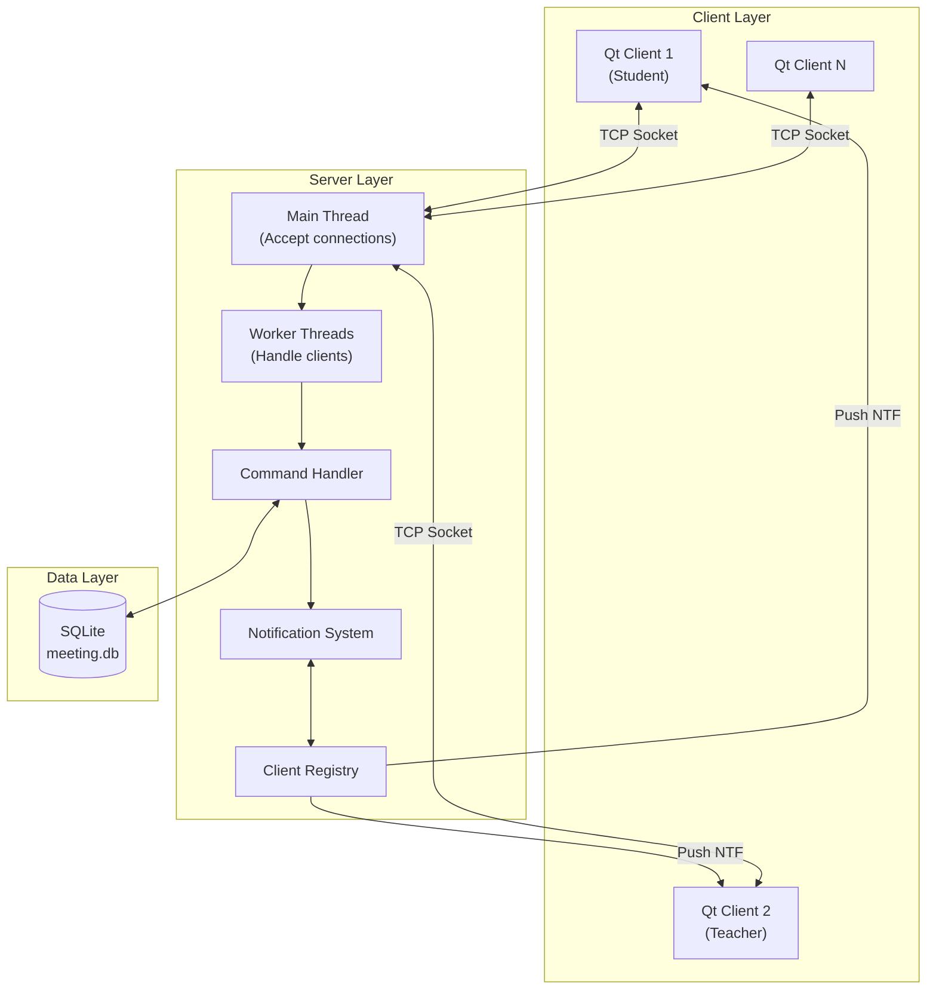
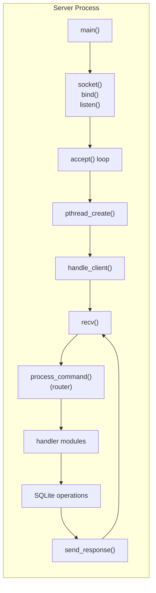
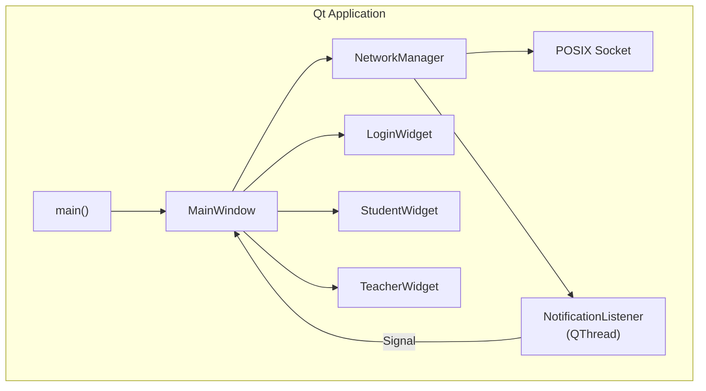

# BÁO CÁO KIẾN TRÚC PHẦN MỀM
# HỆ THỐNG QUẢN LÝ MEETING SINH VIÊN - GIẢNG VIÊN

---

## 1. GIỚI THIỆU

### 1.1 Mục đích

Báo cáo này mô tả kiến trúc phần mềm của hệ thống "Quản lý Meeting Sinh viên - Giảng viên". Hệ thống nhằm mục đích cung cấp một nền tảng đặt lịch hẹn gặp mặt giữa sinh viên và giảng viên, giúp:

- **Giảng viên**: Khai báo các khung giờ rảnh, quản lý lịch hẹn với sinh viên, ghi chép biên bản cuộc họp.
- **Sinh viên**: Xem slot khả dụng của giảng viên, đặt lịch hẹn (cá nhân hoặc theo nhóm), quản lý nhóm học tập.
- **Hệ thống**: Thông báo realtime khi có sự kiện quan trọng (đặt lịch, hủy lịch, yêu cầu vào nhóm).

### 1.2 Phạm vi

Hệ thống là một ứng dụng Desktop sử dụng giao thức TCP socket với các chức năng chính:

- **Sinh viên (Student)**:
  - Đăng ký / Đăng nhập
  - Xem danh sách giảng viên và slot khả dụng
  - Đặt lịch hẹn (cá nhân hoặc nhóm)
  - Hủy lịch hẹn
  - Xem lịch sử meeting và biên bản
  - Tạo nhóm, xin vào nhóm, duyệt yêu cầu vào nhóm

- **Giảng viên (Teacher)**:
  - Đăng ký / Đăng nhập
  - Khai báo slot thời gian rảnh
  - Xem và quản lý lịch hẹn
  - Viết biên bản cuộc họp

### 1.3 Công nghệ sử dụng

| Thành phần | Công nghệ |
|------------|-----------|
| Server | C (POSIX Sockets, pthreads) |
| Client GUI | Qt5 (C++ với raw POSIX sockets) |
| Database | SQLite3 |
| Giao thức | TCP với custom text-based protocol |
| Hệ điều hành | Linux (WSL) |

---

## 2. MÔ TẢ TỔNG QUAN

### 2.1 Các tác nhân

Phần mềm có 2 tác nhân chính là **Sinh viên (Student)** và **Giảng viên (Teacher)**.

- **Sinh viên** là vai trò của người dùng sau khi đăng ký/đăng nhập với role STUDENT. Sinh viên có thể xem slot của giảng viên, đặt lịch hẹn, quản lý nhóm và xem biên bản cuộc họp.

- **Giảng viên** là vai trò của người dùng sau khi đăng ký/đăng nhập với role TEACHER. Giảng viên có thể tạo các slot thời gian rảnh, xem danh sách lịch hẹn và viết biên bản.

### 2.2 Sơ đồ Use Case

```mermaid
graph TB
    subgraph "Tác nhân"
        S["👨‍🎓 Sinh viên"]
        T["👨‍🏫 Giảng viên"]
    end
    
    subgraph "Hệ Thống Quản Lý Meeting"
        UC1["Đăng ký"]
        UC2["Đăng nhập"]
        UC3["Xem danh sách giảng viên"]
        UC4["Xem slot khả dụng"]
        UC5["Đặt lịch hẹn"]
        UC6["Hủy lịch hẹn"]
        UC7["Xem lịch sử meeting"]
        UC8["Xem biên bản"]
        UC9["Tạo nhóm"]
        UC10["Xem danh sách nhóm"]
        UC11["Yêu cầu vào nhóm"]
        UC12["Duyệt/Từ chối yêu cầu"]
        
        UC13["Khai báo slot"]
        UC14["Sửa slot"]
        UC15["Xóa slot"]
        UC16["Xem danh sách meeting"]
        UC17["Viết biên bản"]
    end
    
    S --> UC1
    S --> UC2
    S --> UC3
    S --> UC4
    S --> UC5
    S --> UC6
    S --> UC7
    S --> UC8
    S --> UC9
    S --> UC10
    S --> UC11
    S --> UC12
    
    T --> UC1
    T --> UC2
    T --> UC13
    T --> UC14
    T --> UC15
    T --> UC16
    T --> UC17
```



### 2.3 Mô tả chi tiết Use Case

#### 2.3.1 Use Case của Sinh viên

| STT | Use Case | Mô tả | Điều kiện tiên quyết |
|-----|----------|-------|----------------------|
| 1 | Đăng ký | Tạo tài khoản sinh viên mới | Chưa có tài khoản |
| 2 | Đăng nhập | Truy cập hệ thống | Có tài khoản |
| 3 | Xem giảng viên | Xem danh sách tất cả giảng viên | Đã đăng nhập |
| 4 | Xem slot | Xem các slot khả dụng của một GV | Đã đăng nhập |
| 5 | Đặt lịch | Đặt meeting với GV (cá nhân/nhóm) | Đã đăng nhập, slot còn trống |
| 6 | Hủy lịch | Hủy meeting đã đặt | Có meeting, chưa diễn ra |
| 7 | Xem lịch sử | Xem các meeting đã hoàn thành | Đã đăng nhập |
| 8 | Xem biên bản | Xem nội dung biên bản cuộc họp | Meeting đã có biên bản |
| 9 | Tạo nhóm | Tạo nhóm học tập mới | Đã đăng nhập |
| 10 | Xem danh sách nhóm | Xem danh sách các nhóm đã/chưa là thành viên | Đã đăng nhập |
| 11 | Xin vào nhóm | Gửi yêu cầu tham gia nhóm | Chưa là thành viên |
| 12 | Duyệt yêu cầu | Chấp nhận/từ chối thành viên mới | Là Admin của nhóm |

#### 2.3.2 Use Case của Giảng viên

| STT | Use Case | Mô tả | Điều kiện tiên quyết |
|-----|----------|-------|----------------------|
| 1 | Đăng ký | Tạo tài khoản giảng viên mới | Chưa có tài khoản |
| 2 | Đăng nhập | Truy cập hệ thống | Có tài khoản |
| 3 | Khai báo slot | Tạo khung giờ rảnh | Đã đăng nhập |
| 4 | Sửa slot | Thay đổi thông tin slot | Slot chưa có booking |
| 5 | Xóa slot | Xóa slot đã tạo | Slot chưa có booking |
| 6 | Xem meeting | Xem danh sách lịch hẹn | Đã đăng nhập |
| 7 | Viết biên bản | Ghi chép nội dung cuộc họp | Meeting đã diễn ra |

---

## 3. KIẾN TRÚC HỆ THỐNG

### 3.1 Kiến trúc tổng quan

Hệ thống sử dụng kiến trúc **Client-Server** với giao thức TCP:



### 3.2 Kiến trúc Server

Server được thiết kế theo mô hình **Multi-threaded** với cấu trúc modular:



**Cấu trúc thư mục server:**

```
server/
├── include/
│   ├── server.h              # Header chính
│   ├── core/                 # Core system modules
│   │   ├── client_registry.h # Quản lý clients
│   │   └── database.h        # Database initialization
│   ├── handlers/             # Business logic handlers
│   │   ├── auth_handler.h
│   │   ├── slot_handler.h
│   │   ├── meeting_handler.h
│   │   ├── group_handler.h
│   │   └── minutes_handler.h
│   └── utils/
│       └── utils.h           # Helper functions
├── src/
│   ├── main.c                # Entry point, server loop
│   ├── router.c              # Command routing
│   ├── core/
│   │   ├── client_registry.c # Client tracking
│   │   └── database.c        # DB initialization
│   ├── handlers/
│   │   ├── auth_handler.c    # Authentication (2 funcs)
│   │   ├── slot_handler.c    # Slot management (4 funcs)
│   │   ├── meeting_handler.c # Meetings (6 funcs)
│   │   ├── group_handler.c   # Groups (7 funcs)
│   │   └── minutes_handler.c # Minutes (3 funcs)
│   └── utils/
│       └── utils.c           # Notifications, helpers
└── Makefile
```

**Các module chính:**

| Module | File | Trách nhiệm | Số dòng |
|--------|------|-------------|---------|
| **Core** | `main.c` | Entry point, server initialization | ~99 |
|  | `router.c` | Command routing | ~88 |
|  | `client_registry.c` | Client tracking & registry | ~59 |
|  | `database.c` | Database initialization | ~44 |
| **Handlers** | `auth_handler.c` | REGISTER, LOGIN | ~110 |
|  | `slot_handler.c` | DECLARE_SLOT, EDIT_SLOT, VIEW_SLOTS, VIEW_TEACHERS | ~234 |
|  | `meeting_handler.c` | BOOK_MEETING_*, CANCEL_MEETING, VIEW_MEETINGS_* | ~484 |
|  | `group_handler.c` | CREATE_GROUP, VIEW_GROUPS, *_JOIN_REQUEST | ~469 |
|  | `minutes_handler.c` | SAVE_MINUTES, UPDATE_MINUTES, VIEW_MINUTES | ~208 |
| **Utils** | `utils.c` | send_response, get_value, notifications | ~110 |

**Luồng xử lý request:**

1. `main.c` → Accept connection → Create thread
2. `handle_client()` → Receive message
3. `router.c::process_command()` → Parse command
4. Route to appropriate handler (auth/slot/meeting/group/minutes)
5. Handler → Query/Update database
6. `utils.c::send_response()` → Send result
7. Optional: `utils.c::send_notification()` → Push to other clients


### 3.3 Kiến trúc Client Qt



**Các thành phần chính:**
- `NetworkManager`: Quản lý kết nối TCP, gửi/nhận message
- `NotificationListener`: Thread riêng lắng nghe thông báo từ server
- `LoginWidget`: Giao diện đăng nhập/đăng ký
- `StudentWidget`: Giao diện cho sinh viên
- `TeacherWidget`: Giao diện cho giảng viên

---

## 4. THIẾT KẾ CƠ SỞ DỮ LIỆU

### 4.1 Sơ đồ ER

```mermaid
erDiagram
    users {
        int user_id PK
        string username UK
        string password
        string role
        string full_name
    }
    
    slots {
        int slot_id PK
        int teacher_id FK
        date date
        time start_time
        time end_time
        string slot_type
        int max_group_size
    }

**Business Rules & Validations**:

1. **Slot Type Constraints** (Server-side enforcement):
   - `INDIVIDUAL`: `max_group_size` **bắt buộc = 1** (không cho phép override)
   - `GROUP`: `max_group_size` **mặc định = 5** (có thể override)
   - `BOTH`: `max_group_size` **mặc định =5** (có thể override)

2. **Edit/Delete Protection**:
   - Slot **KHÔNG được sửa/xóa** nếu đã có booking với `status = 'BOOKED'`
   - Response: `403|msg=Cannot_modify_booked_slot`

3. **Group Meeting Capacity**:
   - Khi đặt lịch nhóm: Số thành viên nhóm **KHÔNG được vượt quá** `max_group_size` của slot
   - Response nếu vi phạm: `400|msg=Group_too_large;member_count=X;max_size=Y`

4. **Group Existence Validation**:
   - Khi gửi yêu cầu tham gia: `group_id` **phải tồn tại** trong bảng `groups`
   - Response nếu không tồn tại: `404|msg=Group_not_found`

erDiagram
    meetings {
        int meeting_id PK
        int slot_id FK
        int teacher_id FK
        int student_id FK
        int group_id FK
        string meeting_type
        string status
    }
    
    groups {
        int group_id PK
        string group_name
        int created_by FK
    }
    
    group_members {
        int group_id FK
        int user_id FK
        int role
    }
    
    join_requests {
        int request_id PK
        int group_id FK
        int user_id FK
        string note
        string status
    }
    
    meeting_minutes {
        int minute_id PK
        int meeting_id FK
        text content
        datetime created_at
        datetime updated_at
    }
    
    pending_notifications {
        int id PK
        int user_id FK
        string type
        text payload
        datetime created_at
    }
    
    users ||--o{ slots : "creates"
    users ||--o{ meetings : "books"
    users ||--o{ groups : "creates"
    users ||--o{ pending_notifications : "receives"
    slots ||--o{ meetings : "has"
    groups ||--o{ meetings : "books"
    groups ||--o{ group_members : "has"
    users ||--o{ group_members : "belongs to"
    groups ||--o{ join_requests : "receives"
    users ||--o{ join_requests : "sends"
    meetings ||--o| meeting_minutes : "has"
```

### 4.2 Mô tả các bảng

| Bảng | Mô tả |
|------|-------|
| `users` | Thông tin người dùng (sinh viên/giảng viên) |
| `slots` | Các slot thời gian do giảng viên tạo |
| `meetings` | Các cuộc hẹn đã được đặt |
| `groups` | Nhóm học tập của sinh viên |
| `group_members` | Thành viên của nhóm (role: 0=member, 1=admin) |
| `join_requests` | Yêu cầu xin vào nhóm |
| `meeting_minutes` | Biên bản cuộc họp |
| `pending_notifications` | Thông báo chờ gửi cho user offline |

---

## 5. GIAO THỨC TRUYỀN THÔNG

### 5.1 Format Message

#### 5.1.1 Request Format (Client → Server)

```
COMMAND|key1=value1;key2=value2;...\r\n
```

**Cấu trúc:**
- `COMMAND`: Tên lệnh (viết hoa, không có khoảng trắng)
- `|`: Dấu phân cách giữa command và payload
- `key=value`: Các tham số (phân cách bởi `;`)
- `\r\n`: Kết thúc message

**Ví dụ:**
```
LOGIN|username=student1;password=123\r\n
BOOK_MEETING_INDIV|slot_id=5;student_id=10\r\n
CREATE_GROUP|group_name=AI Study Group;creator_id=5\r\n
```

#### 5.1.2 Response Format (Server → Client)

```
STATUS_CODE|key1=value1;key2=value2;...\r\n
```

**Các status code:**

| Code | Ý nghĩa | Sử dụng |
|------|---------|---------|
| `200` | OK | Thành công (query, update) |
| `201` | Created | Tạo mới thành công |
| `202` | Accepted | Yêu cầu được chấp nhận (pending) |
| `400` | Bad Request | Thiếu tham số, format sai |
| `401` | Unauthorized | Chưa đăng nhập, token không hợp lệ |
| `403` | Forbidden | Không có quyền (ví dụ: chỉ admin mới duyệt) |
| `404` | Not Found | Không tìm thấy resource |
| `409` | Conflict | Trùng lặp, slot đã book |

**Ví dụ:**
```
200|user_id=10;role=STUDENT;full_name=Nguyen Van A\r\n
201|meeting_id=42;status=BOOKED\r\n
400|error=Missing required field: slot_id\r\n
409|error=Slot already booked\r\n
```

### 5.2 Danh sách Commands

#### 5.2.1 Authentication

**Đăng ký:**
```
C→S: REGISTER|role=<r>;username=<u>;password=<p>;full_name=<f>\r\n
S→C: 201|user_id=<id>;msg=Registered\r\n
     Error: 409|msg=Username_exists\r\n
            400|msg=Missing_fields\r\n
```

**Ví dụ:**
```
C→S: REGISTER|role=STUDENT;username=student1;password=123456;full_name=Nguyen Van A\r\n
S→C: 201|user_id=10;msg=Registered\r\n
```

**Đăng nhập:**
```
C→S: LOGIN|username=<u>;password=<p>\r\n
S→C: 200|user_id=<id>;token=<token>;msg=Login_OK\r\n
     Error: 404|msg=User_not_found_or_Wrong_password\r\n
```

**Ví dụ:**
```
C→S: LOGIN|username=student1;password=123456\r\n
S→C: 200|user_id=10;token=token_10_STUDENT;msg=Login_OK\r\n
```

**Token Format:** `token_<user_id>_<role>`

---

#### 5.2.2 Slot Management (Teacher only)

**Tạo slot mới:**
```
C→S: DECLARE_SLOT|token=<t>;date=<d>;start_time=<st>;end_time=<et>;slot_type=<type>;max_group_size=<max>\r\n
S→C: 201|slot_id=<id>;msg=Slot_created\r\n
     Error: 409|msg=Time_conflict;conflicting_slot=<id>\r\n
            400|msg=Missing_fields\r\n
            401|msg=Invalid_token\r\n
```

**Ví dụ:**
```
C→S: DECLARE_SLOT|token=token_5_TEACHER;date=2024-01-15;start_time=09:00;end_time=10:00;slot_type=INDIVIDUAL;max_group_size=1\r\n
S→C: 201|slot_id=20;msg=Slot_created\r\n

# Time conflict error:
S→C: 409|msg=Time_conflict;conflicting_slot=18\r\n
```

**Business Rules:**
- `slot_type=INDIVIDUAL` → `max_group_size` tự động = 1 (server enforce)
- `slot_type=GROUP` hoặc `BOTH` → `max_group_size` mặc định = 5 (có thể thay đổi)
- Time overlap validation: Không được trùng với slots khác của cùng teacher

---

**Xem slots của teacher (for teacher):**
```
C→S: VIEW_SLOTS|token=<teacher_token>\r\n
S→C: 200|slots=<slot1>#<slot2>#...\r\n
```

**Slot format:** `slot_id,date,start_time,end_time,slot_type,max_group_size,status`  
**Status:** `AVAILABLE` | `BOOKED`

**Ví dụ:**
```
C→S: VIEW_SLOTS|token=token_5_TEACHER\r\n
S→C: 200|slots=20,2024-01-15,09:00,10:00,INDIVIDUAL,1,AVAILABLE#21,2024-01-15,14:00,15:00,GROUP,5,BOOKED\r\n
```

---

**Xem slots theo teacher (for student):**
```
C→S: VIEW_SLOTS|teacher_id=<tid>\r\n
S→C: 200|slots=<slot1>#<slot2>#...\r\n
```

**Note:** Chỉ trả về slots có `status=AVAILABLE` hoặc `BOOKED` (exclude `DONE`)

**Ví dụ:**
```
C→S: VIEW_SLOTS|teacher_id=5\r\n
S→C: 200|slots=20,2024-01-15,09:00,10:00,INDIVIDUAL,1,AVAILABLE#22,2024-01-16,09:00,10:00,BOTH,5,BOOKED\r\n
```

---

**Xem danh sách teachers:**
```
C→S: VIEW_TEACHERS\r\n
S→C: 200|teachers=<t1>#<t2>#...\r\n
```

**Teacher format:** `user_id,full_name,available_slot_count`

**Ví dụ:**
```
C→S: VIEW_TEACHERS\r\n
S→C: 200|teachers=5,Dr. Nguyen,3#7,Prof. Tran,0#9,Dr. Le,5\r\n
```

---

**Sửa slot:**
```
C→S: EDIT_SLOT|token=<t>;slot_id=<sid>;action=UPDATE;date=<d>;start_time=<st>;end_time=<et>;slot_type=<type>;max_group_size=<max>\r\n
S→C: 200|slot_id=<sid>;msg=Slot_updated\r\n
     Error: 404|msg=Slot_not_found_or_Not_owner\r\n
            403|msg=Cannot_modify_booked_slot\r\n
            409|msg=Time_conflict;conflicting_slot=<id>\r\n
```

**Ví dụ:**
```
C→S: EDIT_SLOT|token=token_5_TEACHER;slot_id=20;action=UPDATE;date=2024-01-16;start_time=14:00;end_time=15:00;slot_type=INDIVIDUAL;max_group_size=1\r\n
S→C: 200|slot_id=20;msg=Slot_updated\r\n

# Nếu slot đã có booking:
S→C: 403|msg=Cannot_modify_booked_slot\r\n

# Nếu trùng giờ với slot khác:
S→C: 409|msg=Time_conflict;conflicting_slot=25\r\n
```

---

**Xóa slot:**
```
C→S: EDIT_SLOT|token=<t>;slot_id=<sid>;action=DELETE\r\n
S→C: 200|slot_id=<sid>;msg=Slot_deleted\r\n
     Error: 404|msg=Slot_not_found_or_Not_owner\r\n
            403|msg=Cannot_modify_booked_slot\r\n
```

**Ví dụ:**
```
C→S: EDIT_SLOT|token=token_5_TEACHER;slot_id=20;action=DELETE\r\n
S→C: 200|slot_id=20;msg=Slot_deleted\r\n
```

---

#### 5.2.3 Meeting Management

**Đặt lịch cá nhân:**
```
C→S: BOOK_MEETING_INDIV|token=<t>;teacher_id=<tid>;slot_id=<sid>\r\n
S→C: 201|meeting_id=<mid>;msg=Meeting_created\r\n
     Error: 409|msg=Time_conflict;conflicting_meeting=<mid>\r\n
            409|msg=Slot_already_booked\r\n
            404|msg=Slot_not_found\r\n
            400|msg=Missing_fields\r\n
```

**Ví dụ:**
```
C→S: BOOK_MEETING_INDIV|token=token_10_STUDENT;teacher_id=5;slot_id=20\r\n
S→C: 201|meeting_id=100;msg=Meeting_created\r\n

# Student đã có meeting trùng giờ:
S→C: 409|msg=Time_conflict;conflicting_meeting=95\r\n

# Slot đã được người khác đặt:
S→C: 409|msg=Slot_already_booked\r\n
```

**Server gửi notification:**
```
NTF → Teacher: NTF|type=MEETING_BOOKED;meeting_id=100;slot_id=20;meeting_type=INDIVIDUAL\r\n
```

---

**Đặt lịch theo nhóm:**
```
C→S: BOOK_MEETING_GROUP|token=<t>;teacher_id=<tid>;slot_id=<sid>;group_id=<gid>\r\n
S→C: 201|meeting_id=<mid>;msg=Meeting_created\r\n
     Error: 403|msg=Not_group_admin\r\n
            409|msg=Time_conflict;conflicting_meeting=<mid>\r\n
            409|msg=Slot_already_booked\r\n
            409|msg=Group_size_exceeded;max=<max>;actual=<count>\r\n
            404|msg=Slot_not_found\r\n
```

**Ví dụ:**
```
C→S: BOOK_MEETING_GROUP|token=token_10_STUDENT;teacher_id=5;slot_id=20;group_id=3\r\n
S→C: 201|meeting_id=101;msg=Meeting_created\r\n

# Không phải admin:
S→C: 403|msg=Not_group_admin\r\n

# Nhóm quá đông:
S→C: 409|msg=Group_size_exceeded;max=5;actual=6\r\n

# Member trong nhóm có lịch trùng:
S→C: 409|msg=Time_conflict;conflicting_meeting=88\r\n
```

**Server gửi notification:**
```
NTF → Teacher: NTF|type=MEETING_BOOKED;meeting_id=101;slot_id=20;group_id=3;meeting_type=GROUP\r\n
NTF → All Members: NTF|type=MEETING_BOOKED;meeting_id=101;slot_id=20;group_id=3;meeting_type=GROUP\r\n
```

---

**Xem danh sách meetings:**
```
C→S: VIEW_MEETINGS|token=<t>\r\n
S→C: 200|meetings=<m1>#<m2>#...\r\n
```

**Meeting format:** `meeting_id,slot_id,date,start_time,end_time,teacher_name,meeting_type,status,group_id`

**Ví dụ:**
```
C→S: VIEW_MEETINGS|token=token_10_STUDENT\r\n
S→C: 200|meetings=100,20,2024-01-15,09:00,10:00,Dr. Nguyen,INDIVIDUAL,BOOKED,NULL#101,21,2024-01-16,14:00,15:00,Prof. Tran,GROUP,BOOKED,3\r\n
```

---

**Xem lịch sử meetings (DONE):**
```
C→S: VIEW_MEETING_HISTORY|token=<t>\r\n
S→C: 200|history=<m1>#<m2>#...\r\n
```

**Ví dụ:**
```
C→S: VIEW_MEETING_HISTORY|token=token_10_STUDENT\r\n
S→C: 200|history=85,15,2024-01-10,09:00,10:00,Dr. Le,INDIVIDUAL,DONE,NULL\r\n
```

---

**Hủy meeting:**
```
C→S: CANCEL_MEETING|token=<t>;meeting_id=<mid>;reason=<r>\r\n
S→C: 200|msg=Meeting_cancelled\r\n
     Error: 404|msg=Meeting_not_found\r\n
            403|msg=Permission_denied\r\n
```

**Permission rules:**
- Teacher: Cancel TẤT CẢ meetings của mình
- Student: Cancel meetings cá nhân của mình
- Group admin: Cancel group meetings (members thường KHÔNG được)

**Ví dụ:**
```
C→S: CANCEL_MEETING|token=token_10_STUDENT;meeting_id=100;reason=Cannot attend\r\n
S→C: 200|msg=Meeting_cancelled\r\n

# Không có quyền:
S→C: 403|msg=Permission_denied\r\n
```

**Server gửi notification:**
```
NTF → Teacher & Student: NTF|type=MEETING_CANCELLED;meeting_id=100\r\n
```

---

**Hoàn thành meeting (teacher only):**
```
C→S: COMPLETE_MEETING|token=<teacher_token>;meeting_id=<mid>\r\n
S→C: 200|msg=Meeting_completed\r\n
     Error: 404|msg=Meeting_not_found\r\n
            403|msg=Not_meeting_teacher\r\n
            400|msg=Invalid_status;current=<status>\r\n
```

**Ví dụ:**
```
C→S: COMPLETE_MEETING|token=token_5_TEACHER;meeting_id=100\r\n
S→C: 200|msg=Meeting_completed\r\n

# Không phải teacher của meeting:
S→C: 403|msg=Not_meeting_teacher\r\n

# Status không phải BOOKED:
S→C: 400|msg=Invalid_status;current=CANCELLED\r\n
```

---

#### 5.2.4 Group Management

**Tạo nhóm:**
```
C→S: CREATE_GROUP|token=<t>;group_name=<name>\r\n
S→C: 201|group_id=<gid>;msg=Group_created\r\n
     Error: 400|msg=Missing_fields\r\n
```

**Ví dụ:**
```
C→S: CREATE_GROUP|token=token_10_STUDENT;group_name=Team Alpha\r\n
S→C: 201|group_id=5\r\n
```

**Note:** Response chỉ có `group_id`, không có `msg`

---

**Xem danh sách groups:**
```
C→S: VIEW_GROUPS|token=<t>\r\n
S→C: 200|groups=<g1>#<g2>#...\r\n
```

**Group format:** `group_id,group_name,member_count,is_member,role`
- `is_member`: `1` nếu user là member, `0` nếu không
- `role`: `1` = admin, `0` = member (chỉ có ý nghĩa khi `is_member=1`)

**Ví dụ:**
```
C→S: VIEW_GROUPS|token=token_10_STUDENT\r\n
S→C: 200|groups=3,Team Alpha,4,1,1#5,Team Beta,3,1,0#7,Team Gamma,5,0,0\r\n
```

**Giải thích:**
- Group 3: Team Alpha - 4 members - User IS member và IS admin
- Group 5: Team Beta - 3 members - User IS member nhưng NOT admin
- Group 7: Team Gamma - 5 members - User NOT member

**Client filtering:**
- My groups: filter `is_member=1`
- Other groups: filter `is_member=0`

---

**Xem members của nhóm (VIEW_GROUP_DETAIL):**
```
C→S: VIEW_GROUP_DETAIL|token=<t>;group_id=<gid>\r\n
S→C: 200|group_id=<gid>;group_name=<name>;members=<m1>#<m2>#...\r\n
     Error: 404|msg=Group_not_found\r\n
```

**Member format:** `user_id,full_name,is_admin`

**Ví dụ:**
```
C→S: VIEW_GROUP_MEMBERS|group_id=3\r\n
S→C: 200|members=10,Nguyen A,1#12,Tran B,0#15,Le C,0\r\n
```

---

**Gửi yêu cầu vào nhóm:**
```
C→S: REQUEST_JOIN_GROUP|token=<t>;group_id=<gid>;note=<note>\r\n
S→C: 202|request_id=<rid>;msg=Request_pending\r\n
     Error: 400|msg=Already_member\r\n
            404|msg=Group_not_found\r\n
            409|msg=Request_already_exists\r\n
```

**Ví dụ:**
```
C→S: REQUEST_JOIN_GROUP|token=token_15_STUDENT;group_id=3;note=Please let me join\r\n
S→C: 202|request_id=50;msg=Request_pending\r\n
```

**Server gửi notification:**
```
NTF → All Admins: NTF|type=NEW_JOIN_REQUEST;group_id=3;user_id=15;username=student5\r\n
```

---

**Xem requests (admin only):**
```
C→S: VIEW_JOIN_REQUESTS|token=<admin_token>;group_id=<gid>\r\n
S→C: 200|requests=<r1>#<r2>#...\r\n
     Error: 403|msg=Not_admin\r\n
```

**Request format:** `request_id,user_id,full_name,note,status`

**Ví dụ:**
```
C→S: VIEW_JOIN_REQUESTS|token=token_10_STUDENT;group_id=3\r\n
S→C: 200|requests=50,15,Le Van C,Please let me join,PENDING#51,18,Pham D,I want to join,PENDING\r\n
```

---

**Duyệt request:**
```
C→S: APPROVE_JOIN_REQUEST|token=<admin_token>;request_id=<rid>\r\n
S→C: 200|msg=Request_approved\r\n
     Error: 403|msg=Not_admin\r\n
```

**Ví dụ:**
```
C→S: APPROVE_JOIN_REQUEST|token=token_10_STUDENT;request_id=50\r\n
S→C: 200|request_id=50;group_id=3;msg=Approved\r\n
```

**Server gửi notification:**
```
NTF → Requester: NTF|type=GROUP_APPROVED;group_id=3;group_name=Team Alpha\r\n
```

---

**Từ chối request:**
```
C→S: REJECT_JOIN_REQUEST|token=<admin_token>;request_id=<rid>;reason=<r>\r\n
S→C: 200|msg=Request_rejected\r\n
     Error: 403|msg=Not_admin\r\n
```

**Ví dụ:**
```
C→S: REJECT_JOIN_REQUEST|token=token_10_STUDENT;request_id=51;reason=Group is full\r\n
S→C: 200|request_id=51;group_id=3;msg=Rejected\r\n
```

**Server gửi notification:**
```
NTF → Requester: NTF|type=GROUP_REJECTED;group_id=3;reason=Group is full\r\n
```

---

#### 5.2.5 Minutes Management

**Lưu biên bản:**
```
C→S: SAVE_MINUTES|token=<t>;meeting_id=<mid>;content=<text>\r\n
S→C: 201|minute_id=<minid>;msg=Minutes_saved\r\n
     Error: 400|msg=Missing_fields\r\n
            403|msg=Permission_denied\r\n
```

**Permission:** Admin của group hoặc student trong individual meeting

**Ví dụ:**
```
C→S: SAVE_MINUTES|token=token_10_STUDENT;meeting_id=100;content=Discussed project requirements...\r\n
S→C: 201|minute_id=25;msg=Minutes_saved\r\n
```

---

**Xem biên bản:**
```
C→S: VIEW_MINUTES|token=<t>;meeting_id=<mid>\r\n
S→C: 200|minute_id=<minid>;content=<text>;created_at=<timestamp>\r\n
     Error: 404|msg=Minutes_not_found\r\n
            403|msg=Permission_denied\r\n
```

**Ví dụ:**
```
C→S: VIEW_MINUTES|token=token_10_STUDENT;meeting_id=100\r\n
S→C: 200|minute_id=25;content=Discussed project requirements...;created_at=2024-01-15 10:30:00\r\n
```

---

**Cập nhật biên bản:**
```
C→S: UPDATE_MINUTES|token=<t>;minute_id=<minid>;content=<text>\r\n
S→C: 200|msg=Minutes_updated\r\n
     Error: 404|msg=Minutes_not_found\r\n
            403|msg=Permission_denied\r\n
```

**Ví dụ:**
```
C→S: UPDATE_MINUTES|token=token_10_STUDENT;minute_id=25;content=Updated content with action items...\r\n
S→C: 200|msg=Minutes_updated\r\n
```

---

### 5.3 Xử lý bản tin

#### 5.3.1 Phía Client

**Gửi request:**
1. Tạo message theo format `COMMAND|params`
2. Append `\r\n`
3. Gửi qua socket: `send(socket_fd, message, strlen(message), 0)`

**Nhận response:**
1. `recv(socket_fd, buffer, BUFFER_SIZE, 0)`
2. Parse status code (phần trước `|`)
3. Parse payload (phần sau `|`, split bởi `;`)
4. Xử lý theo status code:
   - `2xx`: Cập nhật UI, hiển thị thành công
   - `4xx`: Hiển thị lỗi cho user

**Nhận notification** (NotificationListener thread):
1. Liên tục `recv()` trên socket
2. Kiểm tra message bắt đầu bằng `NTF|`
3. Parse type và payload
4. Emit Qt signal để update UI (thread-safe)

#### 5.3.2 Phía Server

**Nhận request:**
1. `recv(client_socket, buffer, BUFFER_SIZE, 0)`
2. Log message với timestamp
3. Parse command và payload:
   ```c
   char *command = strtok(buffer, "|");
   char *payload = strtok(NULL, "");
   ```
4. Route đến handler tương ứng (trong `router.c`)

**Xử lý trong handler:**
1. Parse các tham số từ payload (`get_value()`)
2. Validate dữ liệu (kiểm tra quyền, format)
3. Thực hiện query/update database
4. Gọi `send_response()` với status code và kết quả
5. Nếu cần: Gọi `send_notification()` cho user khác

**Gửi notification:**
1. `find_client_socket(user_id)` để tìm socket của user online
2. Nếu online: Gửi ngay `NTF|...`
3. Nếu offline: `save_pending_notification()` vào DB
4. Khi user login: `send_pending_notifications()` gửi tất cả notification đã lưu

---

## 6. LUỒNG HOẠT ĐỘNG CHI TIẾT

### 6.1 Authentication Flow

#### 6.1.1 Đăng ký tài khoản

```mermaid
sequenceDiagram
    participant C as Client (Qt)
    participant S as Server
    participant DB as Database
    
    C->>S: REGISTER|username=student1;password=123;full_name=Nguyen A;role=STUDENT
    S->>DB: SELECT * FROM users WHERE username='student1'
    
    alt Username đã tồn tại
        DB-->>S: User found
        S-->>C: 409|error=Username already exists
    else Username khả dụng
        DB-->>S: No user found
        S->>DB: INSERT INTO users VALUES (...)
        DB-->>S: user_id=10
        S-->>C: 201|user_id=10;msg=Registration successful
        Note over C: Hiển thị thông báo thành công
    end
```

**Client cần làm:**
- Validate input (username không trống, password ≥ 6 ký tự)
- Gửi REGISTER command
- Xử lý response: Nếu 201 → Chuyển sang màn hình login

**Server cần làm:**
- Kiểm tra username trùng lặp
- Hash password (nếu có)
- Insert vào database
- Trả về user_id

#### 6.1.2 Đăng nhập

```mermaid
sequenceDiagram
    participant C as Client
    participant S as Server
    participant DB as Database
    participant R as Client Registry
    
    C->>S: LOGIN|username=student1;password=123
    S->>DB: SELECT * FROM users WHERE username='student1'
    
    alt User không tồn tại
        DB-->>S: No user found
        S-->>C: 401|error=Invalid credentials
    else Password sai
        DB-->>S: User found (password mismatch)
        S-->>C: 401|error=Invalid credentials
    else Đăng nhập thành công
        DB-->>S: User data (user_id=10, role=STUDENT, ...)
        S->>R: register_client(socket_fd, user_id=10)
        S->>DB: SELECT * FROM pending_notifications WHERE user_id=10
        DB-->>S: Pending notifications
        loop Gửi từng notification
            S->>C: NTF|type=...;...
        end
        S->>DB: DELETE FROM pending_notifications WHERE user_id=10
        S-->>C: 200|user_id=10;role=STUDENT;full_name=Nguyen A
        Note over C: Lưu user_id, chuyển sang màn hình chính
    end
```

**Client cần làm:**
- Lưu `user_id` và `role` để sử dụng cho các request sau
- Chuyển sang StudentWidget hoặc TeacherWidget tùy role
- Bắt đầu NotificationListener thread

**Server cần làm:**
- Xác thực username/password
- Đăng ký client vào registry (cho notification)
- Gửi pending notifications (nếu có)
- Trả về thông tin user

---

### 6.2 Slot Management Flow (Teacher)

#### 6.2.1 Khai báo slot

```mermaid
sequenceDiagram
    participant T as Teacher Client
    participant S as Server
    participant DB as Database
    
    T->>S: DECLARE_SLOT|token=token_5_TEACHER;date=2024-01-15;start_time=09:00;end_time=10:00;slot_type=INDIVIDUAL
    
    Note over S: Enforce slot type constraints
    Note over S: INDIVIDUAL → max_group_size=1
    
    S->>DB: SELECT slot_id FROM slots WHERE teacher_id=5 AND date='2024-01-15' AND (time overlap check)
    
    alt Time conflict detected
        DB-->>S: Existing slot found
        S-->>T: 409|msg=Time_conflict;conflicting_slot=18
        Note over T: Show error: "Trùng thời gian với slot #18"
    else No conflict
        DB-->>S: No overlap
        S->>DB: INSERT INTO slots VALUES (teacher_id=5, date='2024-01-15', ...)
        DB-->>S: slot_id=20
        S-->>T: 201|slot_id=20;msg=Slot_created
        Note over T: Refresh slot list
    end
```

**Client validation cần làm:**
- ✅ `start_time < end_time`
- ✅ `date >= today`
- ✅ Time format valid (HH:MM)

**Server validation đã làm:**
- ✅ Time overlap check với slots của cùng teacher
- ✅ Auto-enforce slot type constraints
- ✅ Token authentication

#### 6.2.2 Sửa/Xóa slot

```mermaid
sequenceDiagram
    participant T as Teacher
    participant S as Server
    participant DB as Database
    
    T->>S: EDIT_SLOT|token=token_5_TEACHER;slot_id=20;action=UPDATE;date=2024-01-16;start_time=14:00;end_time=15:00;...
    
    S->>DB: SELECT slot_id FROM slots WHERE slot_id=20 AND teacher_id=5
    
    alt Not owner
        DB-->>S: No match
        S-->>T: 404|msg=Slot_not_found_or_Not_owner
    else Is owner
        DB-->>S: Slot found
        S->>DB: SELECT COUNT(*) FROM meetings WHERE slot_id=20 AND status='BOOKED'
        
        alt Slot đã được book
            DB-->>S: count > 0
            S-->>T: 403|msg=Cannot_modify_booked_slot
            Note over T: Show error: "Slot đã có người đặt"
        else Slot trống (can modify)
            DB-->>S: count = 0
            
            alt action = UPDATE
                S->>DB: Check time overlap (exclude current slot_id)
                Note over DB: SELECT slot_id FROM slots<br/>WHERE teacher_id=5 AND date='2024-01-16'<br/>AND slot_id != 20 AND (time overlap)
                
                alt Time conflict with other slot
                    DB-->>S: Conflicting slot found (slot_id=25)
                    S-->>T: 409|msg=Time_conflict;conflicting_slot=25
                    Note over T: Error: "Trùng thời gian với slot #25"
                else No time conflict
                    DB-->>S: No overlap
                    S->>DB: UPDATE slots SET date=?, start_time=?, ... WHERE slot_id=20
                    DB-->>S: Success
                    S-->>T: 200|slot_id=20;msg=Slot_updated
                    Note over T: Refresh slot list
                end
            else action = DELETE
                S->>DB: DELETE FROM slots WHERE slot_id=20
                DB-->>S: Success
                S-->>T: 200|slot_id=20;msg=Slot_deleted
                Note over T: Remove from slot list
            end
        end
    end
```

**Business Rules:**
- ✅ **Ownership**: Only slot owner can edit/delete
- ✅ **Booking protection**: Cannot modify slots với BOOKED meetings
- ✅ **Time overlap (UPDATE)**: Updated time cannot conflict với other existing slots
- ✅ **Slot type enforcement**: INDIVIDUAL always has max_group_size=1

**Server validation:**
1. ✅ Token authentication → get teacher_id
2. ✅ Verify ownership (slot belongs to teacher)
3. ✅ Check booking status (must be empty)
4. ✅ **NEW**: Check time overlap for UPDATE (exclude current slot)
5. ✅ Execute UPDATE or DELETE

---

### 6.3 Meeting Management Flow

#### 6.3.1 Đặt lịch hẹn (Individual)

```mermaid
sequenceDiagram
    participant SV as Student Client
    participant Server
    participant DB as Database
    participant CR as Client Registry
    participant GV as Teacher Client
    
    SV->>Server: VIEW_SLOTS|teacher_id=5
    Server->>DB: SELECT slots with booking status (excludes DONE)
    DB-->>Server: Available slots with status
    Server-->>SV: 200|slots=[{slot_id:20,status:AVAILABLE,...}]
    Note over SV: Hiển thị danh sách slots (filtered & sorted)
    
    SV->>Server: BOOK_MEETING_INDIV|token=token_10_STUDENT;teacher_id=5;slot_id=20
    
    Note over Server: Validate từ token
    Server->>DB: Get slot time info (slot_id=20)
    DB-->>Server: date='2024-01-15', start='09:00', end='10:00'
    
    Server->>DB: Check student time conflicts
    Note over DB: Check if student has BOOKED meetings<br/>at same date/time
    
    alt Student has time conflict
        DB-->>Server: Conflicting meeting found (meeting_id=95)
        Server-->>SV: 409|msg=Time_conflict;conflicting_meeting=95
        Note over SV: Error: "Bạn đã có lịch họp trùng giờ!"
    else No time conflict
        DB-->>Server: No conflicts
                    Server->>GV: NTF|type=MEETING_BOOKED;meeting_id=100;...
                    Note over GV: Popup notification
                else Teacher offline
                    Server->>DB: INSERT INTO pending_notifications
                end
            end
        end
    end
```

**Client (Student) cần làm:**
1. Hiển thị danh sách slots với filter/sort
2. Gửi `BOOK_MEETING_INDIV` với `token`, `teacher_id`, `slot_id`
3. Xử lý response:
   - `201`: Hiển thị "Đặt lịch thành công!", refresh meetings
   - `409` + `Time_conflict`: "Bạn đã có lịch họp trùng giờ!"
   - `409` + `Slot_already_booked`: "Slot đã được người khác đặt!"
   - `400`: "Thông tin không hợp lệ"

**Server đã làm:**
1. ✅ Parse token → lấy student_id
2. ✅ Lấy thông tin time của slot
3. ✅ Check time conflict (student có meeting trùng giờ?)
4. ✅ Check slot availability (đã có BOOKED meeting chưa?)
5. ✅ Tạo meeting record với status='BOOKED'
6. ✅ Send notification to teacher

#### 6.3.2 Đặt lịch hẹn theo nhóm (Group)

```mermaid
sequenceDiagram
    participant SV as Student (Admin) Client
    participant Server
    participant DB as Database
    participant GV as Teacher Client
    
    SV->>Server: BOOK_MEETING_GROUP|token=token_10_STUDENT;teacher_id=5;slot_id=20;group_id=3
    
    Note over Server: Validate token
    Server->>DB: Check if student is admin of group_id=3
    
    alt Not group admin
        DB-->>Server: Student not in admins list
        Server-->>SV: 403|msg=Not_group_admin
        Note over SV: Error: "Bạn không phải admin của nhóm!"
    else Is group admin
        DB-->>Server: Student is admin
        
        Server->>DB: Get slot info & max_group_size
        DB-->>Server: date='2024-01-15', start='09:00', end='10:00', max=5
        
        Server->>DB: Count group members
        DB-->>Server: member_count=4
        
        alt Group size exceeds slot capacity
            Note over Server: member_count (4) > max_group_size (5)? No
            Server->>DB: Check if ANY member has time conflict
            Note over DB: Check all group members for<br/>BOOKED meetings at same time
            
            alt Member has time conflict
                DB-->>Server: Conflicting meeting found (meeting_id=88)
                Server-->>SV: 409|msg=Time_conflict;conflicting_meeting=88
                Note over SV: Error: "Thành viên nhóm đã có<br/>lịch họp trùng giờ!"
            else No member conflicts
                DB-->>Server: No conflicts
                Server->>DB: Check if slot already booked
                
                alt Slot đã được book
                    DB-->>Server: Meeting exists (status=BOOKED)
                    Server-->>SV: 409|msg=Slot_already_booked
                    Note over SV: Error: "Slot đã được người khác đặt!"
                else Slot còn trống
                    DB-->>Server: No BOOKED meetings
                    Server->>DB: INSERT INTO meetings (slot_id, teacher_id, group_id,<br/>meeting_type, status) VALUES (20, 5, 3, 'GROUP', 'BOOKED')
                    DB-->>Server: meeting_id=101
                    Server-->>SV: 201|meeting_id=101;msg=Meeting_created
                    
                    Note over Server: Send notifications
                    Server->>DB: Get all group members (group_id=3)
                    DB-->>Server: [member1, member2, member3, ...]
                    
                    loop For each member
                        Server->>SV: NTF|type=MEETING_BOOKED;meeting_id=101;group_id=3
                    end
                    Note over SV: All members notified
                    
                    Server->>GV: NTF|type=MEETING_BOOKED;meeting_id=101;group_id=3
                    Note over GV: Teacher notified
                end
            end
        else Group too large
            Server-->>SV: 409|msg=Group_size_exceeded;max=5;actual=6
            Note over SV: Error: "Nhóm vượt quá<br/>số người tối đa!"
        end
    end
```

**Client (Student Admin) cần làm:**
1. Chỉ **group admin** mới được đặt lịch nhóm
2. Gửi `BOOK_MEETING_GROUP` với `token`, `teacher_id`, `slot_id`, `group_id`
3. Xử lý response:
   - `201`: "Đặt lịch nhóm thành công!"
   - `403` + `Not_group_admin`: "Bạn không phải admin của nhóm!"
   - `409` + `Time_conflict`: "Thành viên nhóm đã có lịch họp trùng giờ!"
   - `409` + `Slot_already_booked`: "Slot đã được người khác đặt!"
   - `409` + `Group_size_exceeded`: "Nhóm vượt quá số người tối đa của slot!"

**Server đã làm:**
1. ✅ Verify student is group admin
2. ✅ Get slot info & max_group_size
3. ✅ Count group members
4. ✅ Validate: member_count ≤ max_group_size
5. ✅ Check time conflicts for **ALL group members**
   - Include members' individual meetings
   - Include members' other group meetings
6. ✅ Check slot availability
7. ✅ Create meeting record with `group_id`
8. ✅ Send notifications to teacher AND all group members

**Key Differences from Individual:**
- 🔒 **Admin-only**: Regular group members CANNOT book
- 👥 **Member validation**: Checks time conflicts for ALL members (not just admin)
- 📊 **Size limit**: Group size must fit slot's `max_group_size`

#### 6.3.3 Hủy lịch hẹn

```mermaid
sequenceDiagram
    participant SV as Student
    participant Server
    participant DB as Database
    participant GV as Teacher
    
    SV->>Server: CANCEL_MEETING|token=token_10_STUDENT;meeting_id=100;reason=Cannot attend
    Server->>DB: SELECT * FROM meetings WHERE meeting_id=100
    
    alt Meeting không tồn tại
        DB-->>Server: Not found
        Server-->>SV: 404|msg=Meeting_not_found
    else Meeting tồn tại
        DB-->>Server: Meeting data (teacher_id=5, student_id=10, group_id=NULL)
        
        Note over Server: Check permission:<br/>- Student can cancel own individual meetings<br/>- Teacher can cancel all their meetings<br/>- Group admin can cancel group meetings
        
        alt No permission
            Server-->>SV: 403|msg=Permission_denied
        else Has permission
            Server->>DB: UPDATE meetings SET status='CANCELLED' WHERE meeting_id=100
            Server-->>SV: 200|msg=Meeting_cancelled
            Note over SV: Remove from meetings list
            
            opt Notification (if implemented)
                Server->>GV: NTF|type=MEETING_CANCELLED;meeting_id=100
                Note over GV: Update meetings list
            end
        end
    end
```

**Cancel Permission Rules:**
- ✅ Teacher: Can cancel ALL meetings của mình
- ✅ Student: Can cancel OWN individual meetings only
- ✅ Group Admin: Can cancel group meetings (regular members cannot)

#### 6.3.3 Hoàn thành meeting

```mermaid
sequenceDiagram
    participant GV as Teacher Client
    participant Server
    participant DB as Database
    
    GV->>Server: COMPLETE_MEETING|token=token_5_TEACHER;meeting_id=100
    Server->>DB: SELECT teacher_id, status FROM meetings WHERE meeting_id=100
    
    alt Meeting not found
        DB-->>Server: Not found
        Server-->>GV: 404|msg=Meeting_not_found
    else Not meeting owner
        DB-->>Server: teacher_id != current_user_id
        Server-->>GV: 403|msg=Not_meeting_teacher
    else Invalid status (not BOOKED)
        DB-->>Server: status='CANCELLED' or 'DONE'
        Server-->>GV: 400|msg=Invalid_status;current=CANCELLED
    else Valid to complete
        DB-->>Server: teacher_id matches, status=BOOKED
        Server->>DB: UPDATE meetings SET status='DONE' WHERE meeting_id=100
        Server-->>GV: 200|msg=Meeting_completed
        Note over GV: Update meetings list<br/>Meeting moves to history
    end
```

**Complete Permission:**
- ✅ Only teacher can complete
- ✅ Only meetings with status='BOOKED' can be completed
- ✅ DONE meetings appear in history (VIEW_MEETING_HISTORY)
- ✅ DONE meetings' slots do NOT appear in VIEW_SLOTS

---

### 6.4 Group Management Flow

#### 6.4.1 Tạo nhóm

```mermaid
sequenceDiagram
    participant SV as Student
    participant Server
    participant DB as Database
    
    SV->>Server: CREATE_GROUP|group_name=AI Study Group;creator_id=10
    Server->>DB: INSERT INTO groups (group_name, created_by) VALUES ('AI Study Group', 10)
    DB-->>Server: group_id=5
    Server->>DB: INSERT INTO group_members (group_id, user_id, role) VALUES (5, 10, 1)
    Note over DB: Creator tự động là admin (role=1)
    Server-->>SV: 201|group_id=5;msg=Group created
    Note over SV: Hiển thị nhóm mới
```

#### 6.4.2 Xin vào nhóm và duyệt

```mermaid
sequenceDiagram
    participant SV as Student (Requester)
    participant Server
    participant DB as Database
    participant Admin as Group Admin
    
    SV->>Server: REQUEST_JOIN_GROUP|group_id=5;user_id=15;note=Please let me join
    Server->>DB: SELECT * FROM group_members WHERE group_id=5 AND user_id=15
    
    alt Đã là thành viên
        DB-->>Server: Member found
        Server-->>SV: 409|error=Already a member
    else Chưa là thành viên
        DB-->>Server: Not a member
        Server->>DB: INSERT INTO join_requests VALUES (...)
        DB-->>Server: request_id=20
        Server-->>SV: 202|request_id=20;msg=Request sent
        Note over SV: Hiển thị "Yêu cầu đã gửi"
        
        Server->>DB: SELECT user_id FROM group_members WHERE group_id=5 AND role=1
        DB-->>Server: admin_user_ids=[10, 12]
        
        loop Gửi notification cho các admin
            Server->>Admin: NTF|type=NEW_JOIN_REQUEST;group_id=5;request_id=20;user_name=Nguyen B
            Note over Admin: Hiển thị popup với nút Approve/Reject
        end
    end
    
    Note over Admin: Admin click "Duyệt"
    Admin->>Server: APPROVE_JOIN_REQUEST|request_id=20
    Server->>DB: SELECT * FROM join_requests WHERE request_id=20
    DB-->>Server: Request data (group_id=5, user_id=15)
    Server->>DB: INSERT INTO group_members (group_id, user_id, role) VALUES (5, 15, 0)
    Server->>DB: UPDATE join_requests SET status='APPROVED' WHERE request_id=20
    Server-->>Admin: 200|msg=Request approved
    
    Server->>SV: NTF|type=GROUP_APPROVED;group_id=5;group_name=AI Study Group
    Note over SV: Hiển thị thông báo được duyệt vào nhóm
```

**Client (Requester) cần làm:**
1. Gửi REQUEST_JOIN_GROUP
2. Nhận notification `GROUP_APPROVED` hoặc `GROUP_REJECTED`
3. Cập nhật danh sách nhóm

**Client (Admin) cần làm:**
1. Nhận notification `NEW_JOIN_REQUEST`
2. Hiển thị popup với thông tin requester
3. Gửi APPROVE hoặc REJECT command
4. Cập nhật danh sách yêu cầu

**Server cần làm:**
1. Lưu join request
2. Tìm admin của nhóm
3. Gửi notification cho admin
4. Khi approve: Thêm vào group_members, gửi notification cho requester

---

### 6.5 Minutes Management Flow

```mermaid
sequenceDiagram
    participant GV as Teacher
    participant Server
    participant DB as Database
    
    Note over GV: Sau khi meeting hoàn thành
    GV->>Server: SAVE_MINUTES|meeting_id=100;content=Discussed project requirements...
    Server->>DB: INSERT INTO meeting_minutes (meeting_id, content) VALUES (100, '...')
    DB-->>Server: minute_id=50
    Server->>DB: UPDATE meetings SET status='DONE' WHERE meeting_id=100
    Server-->>GV: 201|minute_id=50;msg=Minutes saved
    Note over GV: Hiển thị thành công
    
    Note over GV: Sau đó teacher muốn sửa
    GV->>Server: UPDATE_MINUTES|minute_id=50;content=Updated content...
    Server->>DB: UPDATE meeting_minutes SET content='...', updated_at=NOW() WHERE minute_id=50
    Server-->>GV: 200|msg=Minutes updated
```

**Client (Student) xem biên bản:**
```mermaid
sequenceDiagram
    participant SV as Student
    participant Server
    participant DB as Database
    
    SV->>Server: VIEW_MINUTES|meeting_id=100
    Server->>DB: SELECT m.*, mm.content FROM meetings m JOIN meeting_minutes mm ON m.meeting_id = mm.meeting_id WHERE m.meeting_id=100
    
    alt Không có biên bản
        DB-->>Server: No minutes found
        Server-->>SV: 404|error=No minutes available
    else Có biên bản
        DB-->>Server: Minutes data
        Server-->>SV: 200|content=Discussed project...;created_at=...;updated_at=...
        Note over SV: Hiển thị nội dung biên bản
    end
```

---

## 7. KẾT LUẬN

Hệ thống Quản lý Meeting được thiết kế theo mô hình Client-Server với các đặc điểm:

- **Đa luồng (Multi-threaded)**: Server xử lý đồng thời nhiều client
- **Thông báo realtime**: Push notification qua TCP socket
- **Giao diện thân thiện**: Qt5 với giao diện tiếng Việt
- **Cơ sở dữ liệu nhẹ**: SQLite phù hợp cho ứng dụng Desktop
- **Giao thức text-based**: Dễ debug và mở rộng
