# TÀI LIỆU CƠ CHẾ HOẠT ĐỘNG SERVER VÀ CLIENT

## MỤC LỤC

1. [Tổng quan kiến trúc](#1-tổng-quan-kiến-trúc)
2. [Cơ chế hoạt động Server](#2-cơ-chế-hoạt-động-server)
3. [Cơ chế hoạt động Client](#3-cơ-chế-hoạt-động-client)
4. [Luồng giao tiếp Client-Server](#4-luồng-giao-tiếp-client-server)
5. [Xử lý đồng thời và Thread Safety](#5-xử-lý-đồng-thời-và-thread-safety)
6. [Hệ thống thông báo (Notification)](#6-hệ-thống-thông-báo-notification)
7. [Quản lý kết nối và lỗi](#7-quản-lý-kết-nối-và-lỗi)

---

## 1. TỔNG QUAN KIẾN TRÚC

### 1.1 Mô hình Client-Server

Hệ thống sử dụng kiến trúc **Client-Server** với các đặc điểm sau:

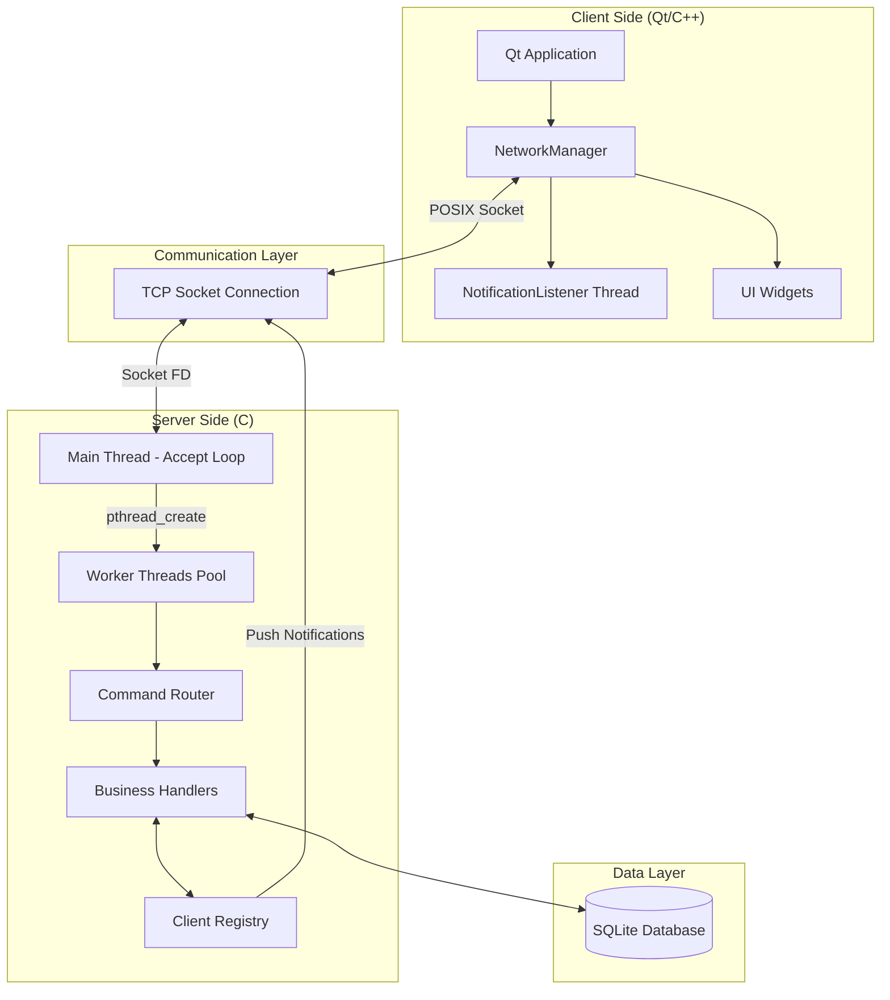

**Các thành phần chính:**

| Thành phần | Công nghệ | Vai trò |
|------------|-----------|---------|
| **Server** | C, POSIX Sockets, pthreads | Xử lý request, quản lý business logic, lưu trữ dữ liệu |
| **Client** | Qt5 (C++), raw POSIX sockets | Giao diện người dùng, gửi request, nhận response/notification |
| **Database** | SQLite3 | Lưu trữ dữ liệu persistent |
| **Protocol** | TCP, custom text-based | Giao tiếp giữa client và server |

### 1.2 Đặc điểm kỹ thuật

- **Connection-oriented**: Sử dụng TCP để đảm bảo tin cậy
- **Multi-threaded Server**: Mỗi client được xử lý bởi một thread riêng
- **Bi-directional Communication**: Server có thể push notification đến client
- **Text-based Protocol**: Dễ debug, human-readable
- **Thread-safe**: Sử dụng mutex để bảo vệ shared resources

---

## 2. CƠ CHẾ HOẠT ĐỘNG SERVER

### 2.1 Khởi động Server

**File:** `server/src/main.c`

```c
int main() {
    int server_fd;
    struct sockaddr_in server_addr;

    // Bước 1: Khởi tạo các hệ thống con
    init_client_registry();  // Khởi tạo danh sách client
    init_db();               // Mở kết nối database

    // Bước 2: Tạo socket
    server_fd = socket(AF_INET, SOCK_STREAM, 0);
    
    // Bước 3: Cho phép tái sử dụng port
    int opt = 1;
    setsockopt(server_fd, SOL_SOCKET, SO_REUSEADDR, &opt, sizeof(opt));
    
    // Bước 4: Bind socket đến địa chỉ và port
    server_addr.sin_family = AF_INET;
    server_addr.sin_addr.s_addr = INADDR_ANY;  // Lắng nghe trên tất cả interface
    server_addr.sin_port = htons(PORT);        // Default: 8080
    bind(server_fd, (struct sockaddr *)&server_addr, sizeof(server_addr));
    
    // Bước 5: Lắng nghe kết nối (queue tối đa 10)
    listen(server_fd, 10);
    
    printf("Server listening on port %d\n", PORT);
    
    // Bước 6: Accept loop (chạy mãi mãi)
    while (1) {
        // Chấp nhận kết nối mới
        // Tạo thread xử lý client
        // Tiếp tục chờ client tiếp theo
    }
}
```

**Luồng khởi tạo:**

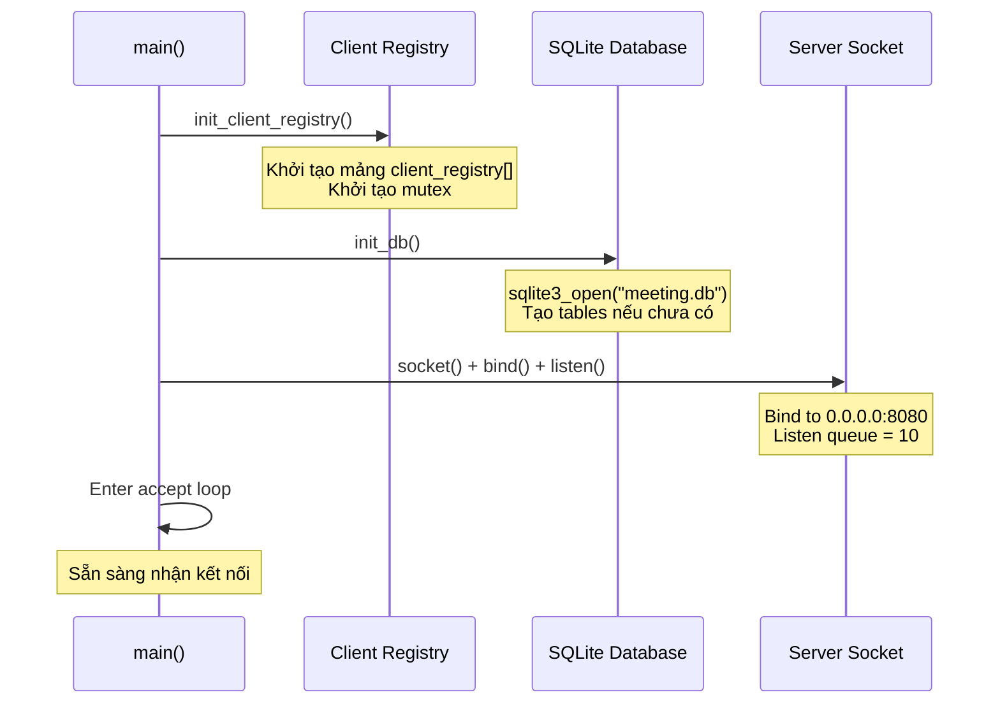

### 2.2 Xử lý Client Connection

**Khi có client kết nối:**

```c
while (1) {
    struct sockaddr_in client_addr;
    socklen_t client_len = sizeof(client_addr);
    
    // 1. Accept kết nối (blocking)
    int client_fd = accept(server_fd, (struct sockaddr *)&client_addr, &client_len);
    
    // 2. Tạo cấu trúc dữ liệu cho client
    client_t *client = malloc(sizeof(client_t));
    client->socket_fd = client_fd;
    client->address = client_addr;
    
    // 3. Tạo thread riêng để xử lý client này
    pthread_t thread_id;
    pthread_create(&thread_id, NULL, handle_client, (void *)client);
    pthread_detach(thread_id);  // Tự động giải phóng khi thread kết thúc
}
```

**Sơ đồ luồng:**

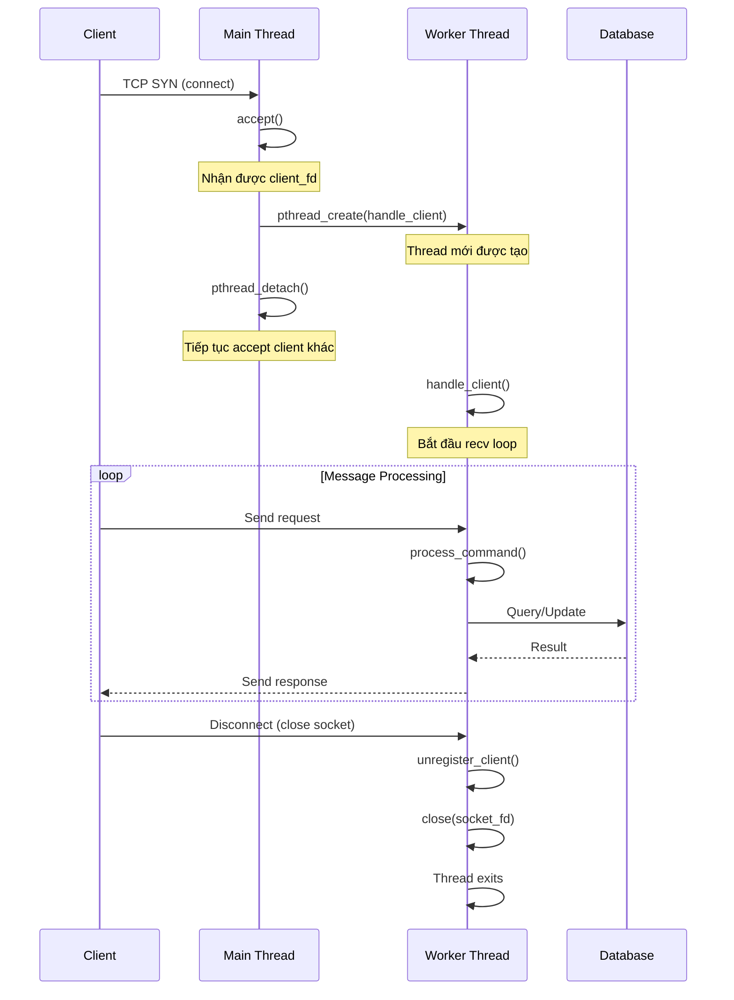

### 2.3 Vòng lặp xử lý message

**File:** `server/src/main.c` - `handle_client()`

```c
void *handle_client(void *arg) {
    client_t *client = (client_t *)arg;
    char buffer[BUFFER_SIZE];  // 4096 bytes
    int n;

    printf("Client connected (socket=%d).\n", client->socket_fd);

    // Vòng lặp recv (blocking)
    while ((n = recv(client->socket_fd, buffer, BUFFER_SIZE - 1, 0)) > 0) {
        buffer[n] = '\0';  // Null-terminate
        process_command(client->socket_fd, buffer);  // Xử lý lệnh
    }

    // Khi vòng lặp kết thúc (n <= 0)
    if (n == 0) {
        printf("Client disconnected (socket=%d).\n", client->socket_fd);
    } else {
        perror("recv failed");
    }

    // Cleanup
    unregister_client(client->socket_fd);
    close(client->socket_fd);
    free(client);
    return NULL;
}
```

**Đặc điểm:**

- **Blocking I/O**: `recv()` chặn thread cho đến khi có dữ liệu
- **One thread per client**: Mỗi client có một thread riêng biệt
- **Synchronous processing**: Xử lý tuần tự từng message
- **Auto cleanup**: Khi client disconnect, thread tự giải phóng tài nguyên

### 2.4 Command Router

**File:** `server/src/router.c` - `process_command()`

```c
void process_command(int socket_fd, char *buffer) {
    // 1. Loại bỏ \r\n
    buffer[strcspn(buffer, "\r\n")] = 0;

    // 2. Log với timestamp
    time_t now = time(NULL);
    struct tm *t = localtime(&now);
    char timestamp[20];
    strftime(timestamp, sizeof(timestamp), "%Y-%m-%d %H:%M:%S", t);
    printf("[%s] [RECV] %s\n", timestamp, buffer);

    // 3. Parse command và payload
    char *command = strtok(buffer, "|");
    char *payload = strtok(NULL, "");  // Lấy phần còn lại

    if (!command) return;

    // 4. Route đến handler tương ứng
    if (strcmp(command, "REGISTER") == 0) {
        handle_register(socket_fd, payload);
    } else if (strcmp(command, "LOGIN") == 0) {
        handle_login(socket_fd, payload);
    }
    // ... (các command khác)
    else {
        char *response = "400|msg=Unknown_command\r\n";
        send_response(socket_fd, response);
    }
}
```

**Luồng xử lý:**

```mermaid
graph TD
    A[Nhận buffer từ recv] --> B[Loại bỏ CRLF]
    B --> C[Log timestamp + message]
    C --> D[Parse: command | payload]
    D --> E{Command?}
    
    E -->|REGISTER| F1[handle_register]
    E -->|LOGIN| F2[handle_login]
    E -->|DECLARE_SLOT| F3[handle_declare_slot]
    E -->|BOOK_MEETING_INDIV| F4[handle_book_meeting_indiv]
    E -->|...| F5[...]
    E -->|Unknown| F6[Send 400 error]
    
    F1 --> G[Handler xử lý]
    F2 --> G
    F3 --> G
    F4 --> G
    F5 --> G
    
    G --> H[Query/Update DB]
    H --> I[send_response]
    I --> J[Optional: send_notification]
```

### 2.5 Handler Pattern

**Ví dụ: Authentication Handler**

**File:** `server/src/handlers/auth_handler.c`

```c
void handle_login(int socket_fd, char *payload) {
    // 1. Parse parameters từ payload
    char username[100] = {0};
    char password[100] = {0};
    
    get_value(payload, "username", username, sizeof(username));
    get_value(payload, "password", password, sizeof(password));
    
    // 2. Validate input
    if (strlen(username) == 0 || strlen(password) == 0) {
        send_response(socket_fd, "400|error=Missing credentials\r\n");
        return;
    }
    
    // 3. Query database
    sqlite3_stmt *stmt;
    const char *sql = "SELECT user_id, role, full_name FROM users "
                      "WHERE username=? AND password=?";
    
    sqlite3_prepare_v2(db, sql, -1, &stmt, NULL);
    sqlite3_bind_text(stmt, 1, username, -1, SQLITE_STATIC);
    sqlite3_bind_text(stmt, 2, password, -1, SQLITE_STATIC);
    
    // 4. Kiểm tra kết quả
    if (sqlite3_step(stmt) == SQLITE_ROW) {
        int user_id = sqlite3_column_int(stmt, 0);
        const char *role = (const char *)sqlite3_column_text(stmt, 1);
        const char *full_name = (const char *)sqlite3_column_text(stmt, 2);
        
        // 5. Đăng ký client vào registry
        register_client(socket_fd, user_id);
        
        // 6. Gửi pending notifications
        send_pending_notifications(socket_fd, user_id);
        
        // 7. Trả về response thành công
        char response[512];
        snprintf(response, sizeof(response), 
                 "200|user_id=%d;role=%s;full_name=%s\r\n",
                 user_id, role, full_name);
        send_response(socket_fd, response);
    } else {
        // Sai thông tin đăng nhập
        send_response(socket_fd, "401|error=Invalid credentials\r\n");
    }
    
    sqlite3_finalize(stmt);
}
```

**Pattern chung cho tất cả handlers:**

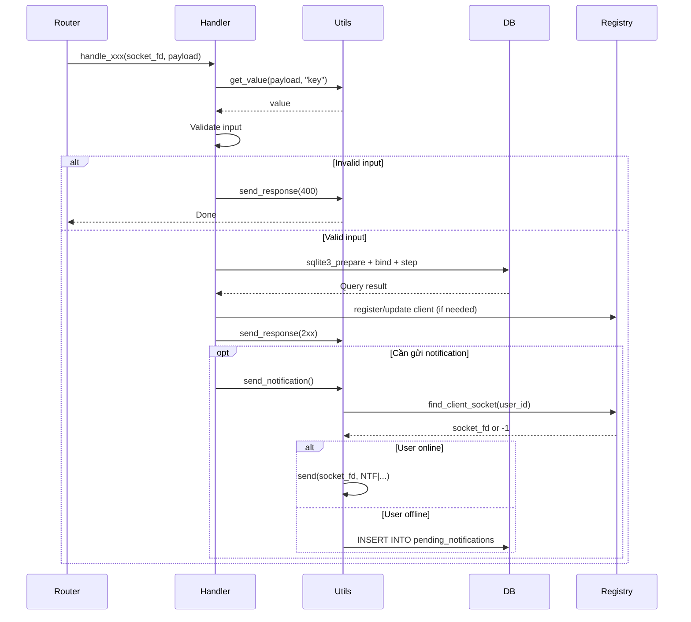

### 2.6 Client Registry - Theo dõi Client Online

**File:** `server/src/core/client_registry.c`

```c
typedef struct {
    int socket_fd;      // File descriptor của socket
    int user_id;        // ID của user đã login
    int is_active;      // 1 nếu slot này đang được sử dụng
} client_entry_t;

client_entry_t client_registry[MAX_CLIENTS];  // Mảng tĩnh, MAX_CLIENTS = 100
pthread_mutex_t registry_mutex;               // Bảo vệ truy cập đồng thời
```

**Các thao tác:**

```c
// 1. Khởi tạo
void init_client_registry() {
    pthread_mutex_lock(&registry_mutex);
    for (int i = 0; i < MAX_CLIENTS; i++) {
        client_registry[i].is_active = 0;
    }
    pthread_mutex_unlock(&registry_mutex);
}

// 2. Đăng ký client (sau khi login)
void register_client(int socket_fd, int user_id) {
    pthread_mutex_lock(&registry_mutex);
    
    for (int i = 0; i < MAX_CLIENTS; i++) {
        if (!client_registry[i].is_active) {
            client_registry[i].socket_fd = socket_fd;
            client_registry[i].user_id = user_id;
            client_registry[i].is_active = 1;
            break;
        }
    }
    
    pthread_mutex_unlock(&registry_mutex);
}

// 3. Tìm socket của user (để gửi notification)
int find_client_socket(int user_id) {
    int result = -1;
    pthread_mutex_lock(&registry_mutex);
    
    for (int i = 0; i < MAX_CLIENTS; i++) {
        if (client_registry[i].is_active && 
            client_registry[i].user_id == user_id) {
            result = client_registry[i].socket_fd;
            break;
        }
    }
    
    pthread_mutex_unlock(&registry_mutex);
    return result;
}

// 4. Hủy đăng ký (khi disconnect)
void unregister_client(int socket_fd) {
    pthread_mutex_lock(&registry_mutex);
    
    for (int i = 0; i < MAX_CLIENTS; i++) {
        if (client_registry[i].is_active && 
            client_registry[i].socket_fd == socket_fd) {
            client_registry[i].is_active = 0;
            break;
        }
    }
    
    pthread_mutex_unlock(&registry_mutex);
}
```

**Vai trò của Client Registry:**

- Theo dõi client nào đang online
- Ánh xạ `user_id` → `socket_fd` để gửi notification
- Thread-safe nhờ mutex
- CRUD đơn giản, hiệu suất cao với mảng tĩnh

---

## 3. CƠ CHẾ HOẠT ĐỘNG CLIENT

### 3.1 Kiến trúc Client Qt

**Các thành phần:**

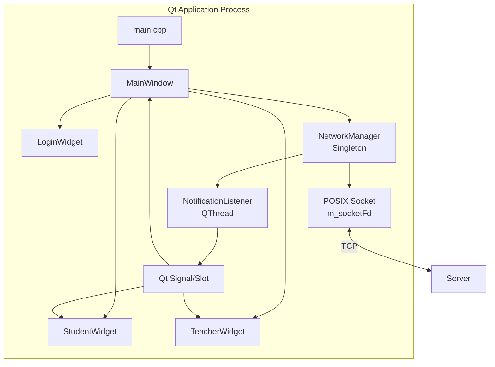

**Phân tách trách nhiệm:**

| Component | Vai trò | Thread |
|-----------|---------|---------|
| `MainWindow` | Quản lý navigation giữa các widget | Main GUI thread |
| `LoginWidget` | Giao diện đăng nhập/đăng ký | Main GUI thread |
| `StudentWidget` | Giao diện sinh viên | Main GUI thread |
| `TeacherWidget` | Giao diện giảng viên | Main GUI thread |
| `NetworkManager` | Quản lý socket, gửi/nhận message | Main GUI thread |
| `NotificationListener` | Lắng nghe notification từ server | Worker thread (QThread) |

### 3.2 NetworkManager - Quản lý kết nối

**File:** `client-qt/src/networkmanager.cpp`

**Singleton pattern:**

```cpp
class NetworkManager : public QObject {
    Q_OBJECT
private:
    static NetworkManager* instance;  // Singleton instance
    
    int m_socketFd;                   // POSIX socket file descriptor
    bool m_connected;                 // Trạng thái kết nối
    bool m_loggedIn;                  // Trạng thái đăng nhập
    
    int m_userId;                     // User ID sau khi login
    QString m_token;                  // Token (reserved)
    QString m_role;                   // STUDENT hoặc TEACHER
    QString m_fullName;               // Tên đầy đủ
    
    QMutex m_socketMutex;             // Bảo vệ socket khỏi race condition
    
    QThread* m_listenerThread;        // Thread lắng nghe notification
    NotificationListener* m_listener;  // Worker object
    
public:
    static NetworkManager* getInstance();
    
    // Kết nối
    bool connectToServer(const QString &ip, int port);
    void disconnectFromServer();
    bool isConnected() const;
    
    // Gửi/Nhận
    QString sendRequest(const QString &command);
    
    // Login info
    void setLoginInfo(int userId, const QString &token, 
                      const QString &role, const QString &fullName);
    void clearLoginInfo();
    
    // Helpers
    static int getStatusCode(const QString &response);
    static QString getValue(const QString &response, const QString &key);
    
signals:
    void notificationReceived(const QString &type, const QString &data);
    void connectionLost();
};
```

### 3.3 Kết nối đến Server

```cpp
bool NetworkManager::connectToServer(const QString &ip, int port) {
    if (m_connected) return true;

    // 1. Tạo socket (POSIX)
    m_socketFd = socket(AF_INET, SOCK_STREAM, 0);
    if (m_socketFd < 0) {
        return false;
    }

    // 2. Thiết lập địa chỉ server
    struct sockaddr_in serverAddr;
    serverAddr.sin_family = AF_INET;
    serverAddr.sin_port = htons(port);  // Default: 8080

    // 3. Convert IP string sang binary
    if (inet_pton(AF_INET, ip.toStdString().c_str(), &serverAddr.sin_addr) <= 0) {
        ::close(m_socketFd);
        m_socketFd = -1;
        return false;
    }

    // 4. Kết nối đến server (blocking)
    if (::connect(m_socketFd, (struct sockaddr *)&serverAddr, sizeof(serverAddr)) < 0) {
        ::close(m_socketFd);
        m_socketFd = -1;
        return false;
    }

    m_connected = true;
    return true;
}
```

**Sơ đồ kết nối:**

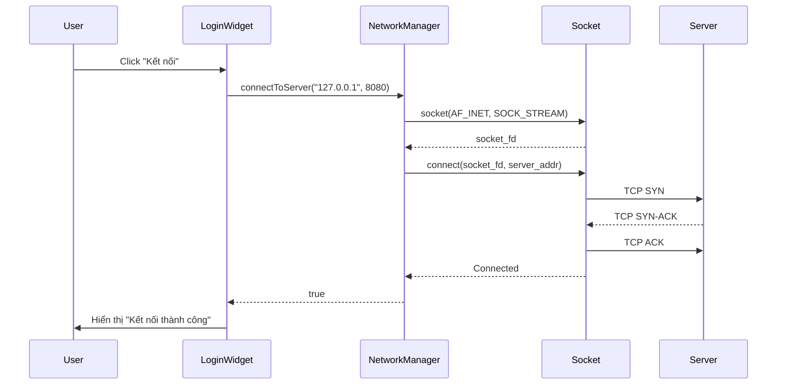

### 3.4 Gửi Request và Nhận Response

```cpp
QString NetworkManager::sendRequest(const QString &command) {
    if (!m_connected) return QString();

    // Lock mutex để tránh nhiều thread gửi cùng lúc
    QMutexLocker locker(&m_socketMutex);

    // 1. Chuyển QString sang std::string
    std::string cmdStr = command.toStdString();
    
    // 2. Gửi qua socket (blocking)
    if (send(m_socketFd, cmdStr.c_str(), cmdStr.length(), 0) < 0) {
        return QString();
    }

    // 3. Nhận response (blocking)
    char buffer[BUFFER_SIZE];  // 4096 bytes
    memset(buffer, 0, BUFFER_SIZE);
    
    int n = recv(m_socketFd, buffer, BUFFER_SIZE - 1, 0);
    if (n <= 0) {
        return QString();  // Connection lost
    }
    buffer[n] = '\0';

    // 4. Chuyển về QString
    return QString::fromUtf8(buffer);
}
```

**Ví dụ sử dụng:**

```cpp
// Trong LoginWidget
void LoginWidget::onLoginClicked() {
    QString username = ui->usernameEdit->text();
    QString password = ui->passwordEdit->text();
    
    // Tạo command string
    QString cmd = QString("LOGIN|username=%1;password=%2\r\n")
                      .arg(username)
                      .arg(password);
    
    // Gửi và nhận response
    QString response = NetworkManager::getInstance()->sendRequest(cmd);
    
    // Parse response
    int statusCode = NetworkManager::getStatusCode(response);
    
    if (statusCode == 200) {
        // Thành công
        int userId = NetworkManager::getValue(response, "user_id").toInt();
        QString role = NetworkManager::getValue(response, "role");
        QString fullName = NetworkManager::getValue(response, "full_name");
        
        // Lưu thông tin
        NetworkManager::getInstance()->setLoginInfo(userId, "", role, fullName);
        
        // Chuyển màn hình
        emit loginSuccessful(role);
    } else {
        // Thất bại
        QString error = NetworkManager::getValue(response, "error");
        QMessageBox::warning(this, "Lỗi", error);
    }
}
```

### 3.5 NotificationListener Thread

**Vai trò:**

- Chạy trên thread riêng, không block UI
- Liên tục lắng nghe socket để nhận notification từ server
- Emit Qt signal khi có notification → UI tự động cập nhật

**Cơ chế:**

```cpp
class NotificationListener : public QObject {
    Q_OBJECT
private:
    int m_socketFd;           // Socket chia sẻ với NetworkManager
    QMutex* m_socketMutex;    // Mutex chia sẻ
    bool m_running;           // Flag để dừng thread
    
public:
    NotificationListener(int socketFd, QMutex *mutex);
    void stop();
    
public slots:
    void process();  // Hàm chạy trong thread
    
signals:
    void notificationReceived(const QString &type, const QString &data);
    void connectionLost();
    void finished();
};
```

**Vòng lặp lắng nghe:**

```cpp
void NotificationListener::process() {
    char buffer[BUFFER_SIZE];
    
    while (m_running) {
        // 1. Sử dụng select() với timeout để kiểm tra dữ liệu sẵn sàng
        fd_set readFds;
        struct timeval tv;
        
        FD_ZERO(&readFds);
        FD_SET(m_socketFd, &readFds);
        
        tv.tv_sec = 0;
        tv.tv_usec = 100000;  // Timeout 100ms
        
        int result = select(m_socketFd + 1, &readFds, nullptr, nullptr, &tv);
        
        if (result > 0 && FD_ISSET(m_socketFd, &readFds)) {
            // 2. Peek data (không xóa khỏi buffer)
            memset(buffer, 0, BUFFER_SIZE);
            int n = recv(m_socketFd, buffer, BUFFER_SIZE - 1, MSG_PEEK);
            
            if (n > 0) {
                QString data = QString::fromUtf8(buffer);
                
                // 3. Kiểm tra xem có phải notification không
                if (data.startsWith("NTF|")) {
                    // 4. Consume data (xóa khỏi buffer)
                    recv(m_socketFd, buffer, n, 0);
                    
                    // 5. Parse và emit signal
                    QString type = NetworkManager::getValue(data, "type");
                    emit notificationReceived(type, data);
                }
            } else if (n == 0) {
                // Connection closed
                emit connectionLost();
                break;
            }
        }
    }
    
    emit finished();
}
```

**Tại sao dùng `MSG_PEEK`?**

- Peek xem dữ liệu có phải notification không
- Nếu không phải (là response của request), để main thread xử lý
- Tránh "ăn mất" response của `sendRequest()`

**Start/Stop Listener:**

```cpp
void NetworkManager::startNotificationListener() {
    if (m_listenerThread) return;  // Đã chạy rồi

    // 1. Tạo thread và worker
    m_listenerThread = new QThread();
    m_listener = new NotificationListener(m_socketFd, &m_socketMutex);
    
    // 2. Chuyển worker sang thread mới
    m_listener->moveToThread(m_listenerThread);

    // 3. Kết nối signals
    connect(m_listenerThread, &QThread::started, 
            m_listener, &NotificationListener::process);
    
    connect(m_listener, &NotificationListener::notificationReceived,
            this, &NetworkManager::notificationReceived);
    
    connect(m_listener, &NotificationListener::connectionLost,
            this, &NetworkManager::connectionLost);

    // 4. Start thread
    m_listenerThread->start();
}

void NetworkManager::stopNotificationListener() {
    if (m_listener) {
        m_listener->stop();  // Đặt m_running = false
    }
    if (m_listenerThread) {
        m_listenerThread->quit();
        m_listenerThread->wait(1000);  // Chờ tối đa 1s
        m_listenerThread = nullptr;
        m_listener = nullptr;
    }
}
```

**Khi nào start/stop?**

- **Start**: Sau khi login thành công (`setLoginInfo()`)
- **Stop**: Khi logout hoặc disconnect (`clearLoginInfo()`, `disconnectFromServer()`)

---

## 4. LUỒNG GIAO TIẾP CLIENT-SERVER

### 4.1 Request-Response Pattern

**Luồng cơ bản:**

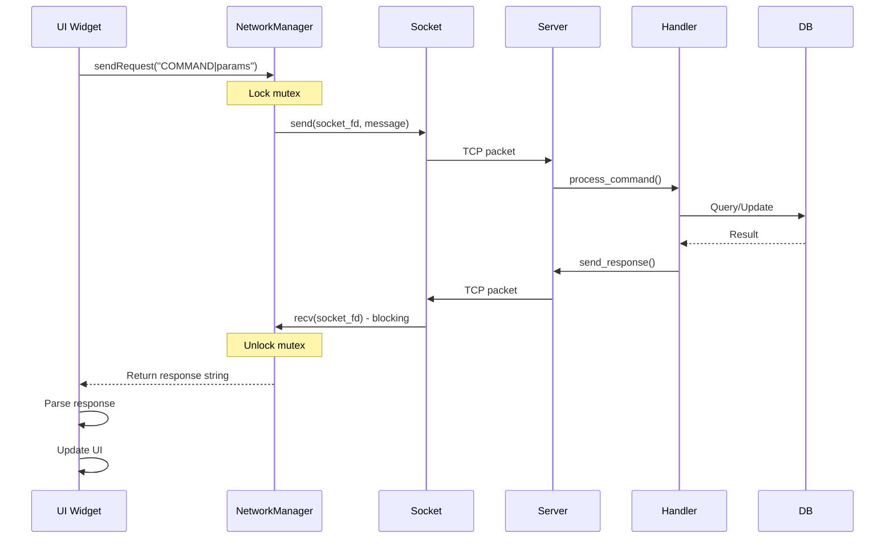

**Ví dụ cụ thể - Đăng ký:**

```mermaid
sequenceDiagram
    participant UI as LoginWidget
    participant NM as NetworkManager
    participant Server
    participant DB
    
    UI->>NM: sendRequest("REGISTER|username=student1;password=123;...")
    
    NM->>Server: REGISTER|username=student1;password=123;...\r\n
    
    Server->>DB: SELECT * FROM users WHERE username='student1'
    
    alt Username đã tồn tại
        DB-->>Server: Found
        Server->>NM: 409|error=Username already exists\r\n
        NM-->>UI: Response: "409|error=..."
        UI->>UI: QMessageBox::warning("Username đã tồn tại")
    else Username khả dụng
        DB-->>Server: Not found
        Server->>DB: INSERT INTO users VALUES (...)
        DB-->>Server: user_id=10
        Server->>NM: 201|user_id=10;msg=Registration successful\r\n
        NM-->>UI: Response: "201|user_id=10;..."
        UI->>UI: QMessageBox::information("Đăng ký thành công!")
        UI->>UI: Chuyển về form login
    end
```

### 4.2 Notification Push Pattern

**Luồng:**

```mermaid
sequenceDiagram
    participant Student as Student Client
    participant StuNM as Student NetworkManager
    participant Server
    participant Registry as Client Registry
    participant TeachNM as Teacher NetworkManager
    participant Teacher as Teacher Client
    
    Note over Teacher: Teacher đã login trước
    Teacher->>TeachNM: setLoginInfo(userId=5, ...)
    TeachNM->>TeachNM: startNotificationListener()
    Note over TeachNM: Listener thread bắt đầu
    
    Student->>StuNM: sendRequest("BOOK_MEETING_INDIV|slot_id=20;student_id=10")
    StuNM->>Server: Request
    
    Server->>Server: Xử lý booking
    Server->>Server: Booking thành công
    
    Server->>Registry: find_client_socket(user_id=5)
    Registry-->>Server: socket_fd=15
    
    Server->>TeachNM: send(15, "NTF|type=MEETING_BOOKED;...")
    
    Note over TeachNM: NotificationListener<br/>recv() nhận được
    TeachNM->>TeachNM: Kiểm tra startsWith("NTF|")
    TeachNM->>TeachNM: emit notificationReceived(...)
    
    TeachNM-->>Teacher: Qt signal
    Teacher->>Teacher: Hiển thị popup notification
    Teacher->>Teacher: Refresh danh sách meetings
```

**Xử lý notification trong UI:**

```cpp
// Trong TeacherWidget
void TeacherWidget::connectSignals() {
    // Kết nối signal từ NetworkManager
    connect(NetworkManager::getInstance(), 
            &NetworkManager::notificationReceived,
            this, 
            &TeacherWidget::onNotificationReceived);
}

void TeacherWidget::onNotificationReceived(const QString &type, const QString &data) {
    if (type == "MEETING_BOOKED") {
        // Parse thông tin
        int meetingId = NetworkManager::getValue(data, "meeting_id").toInt();
        QString studentName = NetworkManager::getValue(data, "student_name");
        QString date = NetworkManager::getValue(data, "date");
        QString time = NetworkManager::getValue(data, "time");
        
        // Hiển thị notification
        QMessageBox::information(this, "Lịch hẹn mới",
            QString("Sinh viên %1 đã đặt lịch:\nNgày: %2\nGiờ: %3")
                .arg(studentName).arg(date).arg(time));
        
        // Refresh danh sách
        loadMeetings();
    }
}
```

### 4.3 Offline Notification Pattern

**Kịch bản:** User offline khi có notification

```mermaid
sequenceDiagram
    participant Student
    participant Server
    participant Registry
    participant DB
    participant Teacher
    
    Note over Teacher: Teacher đang offline
    
    Student->>Server: BOOK_MEETING_INDIV|...
    Server->>Server: Xử lý booking thành công
    
    Server->>Registry: find_client_socket(teacher_id=5)
    Registry-->>Server: -1 (not found)
    
    Note over Server: Teacher offline
    Server->>DB: INSERT INTO pending_notifications<br/>(user_id=5, type='MEETING_BOOKED', payload='...')
    
    Note over Server: Notification được lưu
    
    ... Sau đó ...
    
    Teacher->>Server: LOGIN|username=teacher1;password=...
    Server->>DB: Xác thực thành công
    
    Server->>Registry: register_client(socket_fd, user_id=5)
    
    Server->>DB: SELECT * FROM pending_notifications<br/>WHERE user_id=5
    DB-->>Server: [notification1, notification2, ...]
    
    loop Mỗi notification
        Server->>Teacher: NTF|type=...;...
    end
    
    Server->>DB: DELETE FROM pending_notifications<br/>WHERE user_id=5
    
    Note over Teacher: Nhận được tất cả thông báo<br/>khi vừa đăng nhập
```

---

## 5. XỬ LÝ ĐỒNG THỜI VÀ THREAD SAFETY

### 5.1 Multi-threading trên Server

**Mô hình:**

- **Main thread**: Accept connections (1 thread)
- **Worker threads**: Mỗi client có 1 thread riêng (N threads)
- **Shared resources**: Database, Client Registry

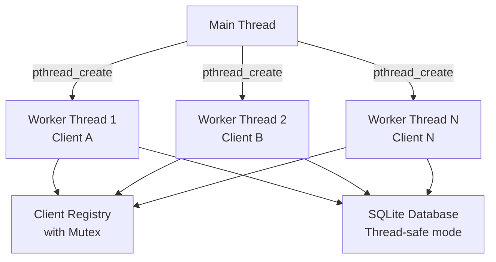

**Thread safety mechanisms:**

1. **Client Registry Mutex:**

```c
pthread_mutex_t registry_mutex = PTHREAD_MUTEX_INITIALIZER;

void register_client(int socket_fd, int user_id) {
    pthread_mutex_lock(&registry_mutex);
    // Critical section - chỉ 1 thread được vào cùng lúc
    for (int i = 0; i < MAX_CLIENTS; i++) {
        if (!client_registry[i].is_active) {
            client_registry[i].socket_fd = socket_fd;
            client_registry[i].user_id = user_id;
            client_registry[i].is_active = 1;
            break;
        }
    }
    pthread_mutex_unlock(&registry_mutex);
}
```

2. **SQLite Serialized Mode:**

```c
void init_db() {
    // Mở database ở chế độ thread-safe
    int rc = sqlite3_open("meeting.db", &db);
    
    // SQLite được compile với SQLITE_THREADSAFE=1
    // Cho phép nhiều thread sử dụng cùng connection
}
```

**Lưu ý:** SQLite có internal locking, không cần mutex thêm.

### 5.2 Multi-threading trên Client Qt

**Mô hình:**

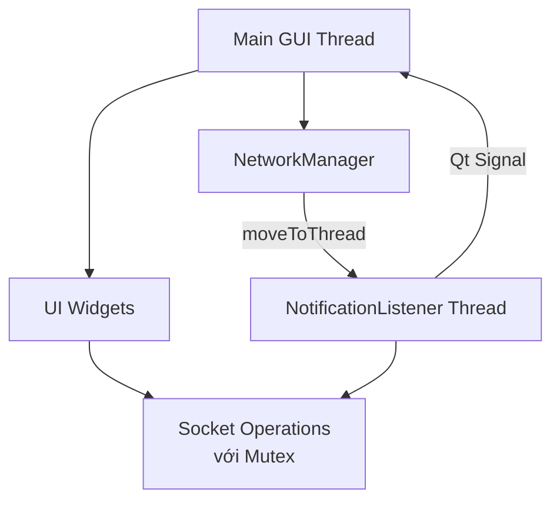

**Thread coordination:**

1. **Main thread:**
   - Vẽ UI
   - Xử lý user input
   - Gọi `NetworkManager::sendRequest()` (synchronized)

2. **Listener thread:**
   - Chạy vòng lặp `select()` + `recv()`
   - Emit signal khi có notification
   - **Không được** gọi UI code trực tiếp

**Mutex protection:**

```cpp
// Main thread gửi request
QString NetworkManager::sendRequest(const QString &command) {
    QMutexLocker locker(&m_socketMutex);  // RAII lock
    
    // send() + recv()
    // Chỉ 1 thread được gửi/nhận cùng lúc
    
}  // Tự động unlock khi ra khỏi scope

// Listener thread đọc notification
void NotificationListener::process() {
    while (m_running) {
        // Không lock mutex khi recv() notification
        // Vì notification đến bất đồng bộ, không conflict với request/response
        int n = recv(m_socketFd, buffer, BUFFER_SIZE - 1, MSG_PEEK);
        
        if (data.startsWith("NTF|")) {
            // Process notification
        }
    }
}
```

**Qt Signal/Slot - Thread-safe communication:**

```cpp
// Từ listener thread
emit notificationReceived(type, data);

// Slot trong main thread
void TeacherWidget::onNotificationReceived(...) {
    // Qt tự động queue signal qua event loop
    // An toàn để update UI
    QMessageBox::information(...);
}
```

### 5.3 Race Condition Scenarios

**Scenario 1: Hai sinh viên book cùng 1 slot**

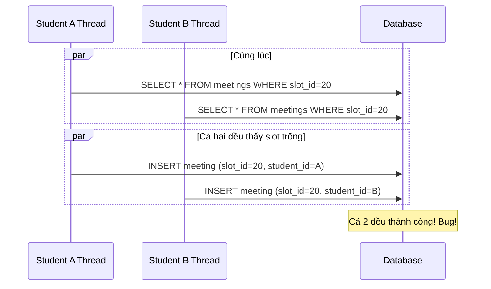

**Giải pháp:** SQLite transaction + UNIQUE constraint

```c
void handle_book_meeting_indiv(int socket_fd, char *payload) {
    sqlite3_exec(db, "BEGIN TRANSACTION", NULL, NULL, NULL);
    
    // 1. Check slot availability
    const char *checkSql = "SELECT COUNT(*) FROM meetings "
                           "WHERE slot_id=? AND status='BOOKED'";
    // ...
    
    if (count > 0) {
        sqlite3_exec(db, "ROLLBACK", NULL, NULL, NULL);
        send_response(socket_fd, "409|error=Slot already booked\r\n");
        return;
    }
    
    // 2. Insert booking
    const char *insertSql = "INSERT INTO meetings (...) VALUES (...)";
    // ...
    
    sqlite3_exec(db, "COMMIT", NULL, NULL, NULL);
}
```

**Scenario 2: Client disconnect giữa chừng**

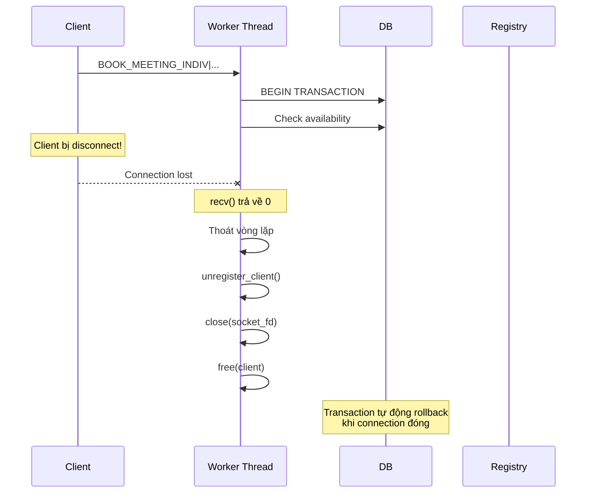

---

## 6. HỆ THỐNG THÔNG BÁO (NOTIFICATION)

### 6.1 Các loại Notification

| Type | Trigger | Sender | Receiver | Payload |
|------|---------|--------|----------|---------|
| `MEETING_BOOKED` | Student đặt lịch | Student | Teacher | `meeting_id`, `student_name`, `date`, `time` |
| `MEETING_CANCELLED` | Hủy lịch | Student/Teacher | Teacher/Student | `meeting_id` |
| `NEW_JOIN_REQUEST` | Xin vào nhóm | Student | Group Admin | `group_id`, `user_id`, `username` |
| `GROUP_APPROVED` | Admin duyệt | Admin | Student | `group_id`, `group_name` |
| `GROUP_REJECTED` | Admin từ chối | Admin | Student | `group_id`, `reason` |

### 6.2 Luồng gửi Notification

**File:** `server/src/utils/utils.c`

```c
void send_notification(int user_id, const char *type, const char *payload) {
    // 1. Tìm socket của user
    int client_socket = find_client_socket(user_id);
    
    if (client_socket != -1) {
        // User đang online
        char notification[1024];
        snprintf(notification, sizeof(notification), 
                 "NTF|type=%s;%s\r\n", type, payload);
        
        send(client_socket, notification, strlen(notification), 0);
        
        printf("[NOTIFICATION] Sent to user %d: %s\n", user_id, notification);
    } else {
        // User offline - lưu vào database
        save_pending_notification(user_id, type, payload);
        
        printf("[NOTIFICATION] Saved for offline user %d\n", user_id);
    }
}

void save_pending_notification(int user_id, const char *type, const char *payload) {
    const char *sql = "INSERT INTO pending_notifications (user_id, type, payload) "
                      "VALUES (?, ?, ?)";
    
    sqlite3_stmt *stmt;
    sqlite3_prepare_v2(db, sql, -1, &stmt, NULL);
    sqlite3_bind_int(stmt, 1, user_id);
    sqlite3_bind_text(stmt, 2, type, -1, SQLITE_STATIC);
    sqlite3_bind_text(stmt, 3, payload, -1, SQLITE_STATIC);
    sqlite3_step(stmt);
    sqlite3_finalize(stmt);
}
```

### 6.3 Gửi pending notifications khi login

**File:** `server/src/handlers/auth_handler.c`

```c
void handle_login(int socket_fd, char *payload) {
    // ... Xác thực thành công ...
    
    // Đăng ký client
    register_client(socket_fd, user_id);
    
    // Gửi pending notifications
    send_pending_notifications(socket_fd, user_id);
    
    // Trả về response
    send_response(socket_fd, "200|user_id=...");
}

void send_pending_notifications(int socket_fd, int user_id) {
    const char *sql = "SELECT type, payload FROM pending_notifications "
                      "WHERE user_id=? ORDER BY created_at ASC";
    
    sqlite3_stmt *stmt;
    sqlite3_prepare_v2(db, sql, -1, &stmt, NULL);
    sqlite3_bind_int(stmt, 1, user_id);
    
    while (sqlite3_step(stmt) == SQLITE_ROW) {
        const char *type = (const char *)sqlite3_column_text(stmt, 0);
        const char *payload = (const char *)sqlite3_column_text(stmt, 1);
        
        // Gửi notification
        char notification[1024];
        snprintf(notification, sizeof(notification), 
                 "NTF|type=%s;%s\r\n", type, payload);
        send(socket_fd, notification, strlen(notification), 0);
        
        usleep(10000);  // Sleep 10ms để tránh gửi quá nhanh
    }
    
    sqlite3_finalize(stmt);
    
    // Xóa đã gửi
    const char *deleteSql = "DELETE FROM pending_notifications WHERE user_id=?";
    sqlite3_prepare_v2(db, deleteSql, -1, &stmt, NULL);
    sqlite3_bind_int(stmt, 1, user_id);
    sqlite3_step(stmt);
    sqlite3_finalize(stmt);
}
```

### 6.4 Xử lý Notification trên Client

**Trong UI widget:**

```cpp
void StudentWidget::connectNotificationHandlers() {
    connect(NetworkManager::getInstance(),
            &NetworkManager::notificationReceived,
            this,
            &StudentWidget::handleNotification);
}

void StudentWidget::handleNotification(const QString &type, const QString &data) {
    if (type == "GROUP_APPROVED") {
        int groupId = NetworkManager::getValue(data, "group_id").toInt();
        QString groupName = NetworkManager::getValue(data, "group_name");
        
        // Hiển thị notification
        QMessageBox::information(this, "Thông báo",
            QString("Bạn đã được duyệt vào nhóm: %1").arg(groupName));
        
        // Refresh danh sách nhóm
        loadMyGroups();
        
    } else if (type == "GROUP_REJECTED") {
        QString reason = NetworkManager::getValue(data, "reason");
        
        QMessageBox::warning(this, "Thông báo",
            QString("Yêu cầu vào nhóm bị từ chối.\nLý do: %1").arg(reason));
    }
}
```

---

## 7. QUẢN LÝ KẾT NỐI VÀ LỖI

### 7.1 Phát hiện Connection Lost

**Server-side:**

```c
void *handle_client(void *arg) {
    // ...
    
    while ((n = recv(client->socket_fd, buffer, BUFFER_SIZE - 1, 0)) > 0) {
        // Process message
    }
    
    // Khi recv() trả về <= 0
    if (n == 0) {
        // Client đóng kết nối bình thường (graceful shutdown)
        printf("Client disconnected (socket=%d).\n", client->socket_fd);
    } else if (n < 0) {
        // Lỗi mạng
        perror("recv failed");
    }
    
    // Cleanup
    unregister_client(client->socket_fd);
    close(client->socket_fd);
    free(client);
    
    return NULL;
}
```

**Client-side:**

```cpp
void NotificationListener::process() {
    while (m_running) {
        int n = recv(m_socketFd, buffer, BUFFER_SIZE - 1, MSG_PEEK);
        
        if (n == 0) {
            // Server đóng kết nối
            emit connectionLost();
            break;
        } else if (n < 0) {
            if (errno == EINTR) {
                // Interrupted by signal, retry
                continue;
            } else {
                // Lỗi khác
                emit connectionLost();
                break;
            }
        }
        
        // Process data...
    }
}
```

**Xử lý trong UI:**

```cpp
void MainWindow::connectNetworkSignals() {
    connect(NetworkManager::getInstance(),
            &NetworkManager::connectionLost,
            this,
            &MainWindow::onConnectionLost);
}

void MainWindow::onConnectionLost() {
    QMessageBox::critical(this, "Lỗi kết nối",
        "Mất kết nối với server. Vui lòng đăng nhập lại.");
    
    // Cleanup
    NetworkManager::getInstance()->clearLoginInfo();
    
    // Về màn hình login
    showLoginWidget();
}
```

### 7.2 Timeout Handling

**Vấn đề:** `recv()` blocking mãi mãi nếu không có dữ liệu

**Giải pháp:** Dùng `select()` với timeout

```cpp
void NotificationListener::process() {
    while (m_running) {
        fd_set readFds;
        struct timeval tv;
        
        FD_ZERO(&readFds);
        FD_SET(m_socketFd, &readFds);
        
        tv.tv_sec = 0;
        tv.tv_usec = 100000;  // 100ms timeout
        
        int result = select(m_socketFd + 1, &readFds, nullptr, nullptr, &tv);
        
        if (result > 0) {
            // Có dữ liệu sẵn sàng
            // recv() sẽ không block
        } else if (result == 0) {
            // Timeout - không có dữ liệu
            // Kiểm tra m_running và loop tiếp
        } else {
            // Lỗi
            if (errno != EINTR) {
                emit connectionLost();
                break;
            }
        }
    }
}
```

### 7.3 Retry Mechanism

**Kết nối lại khi mất kết nối:**

```cpp
bool NetworkManager::reconnect() {
    disconnectFromServer();
    
    // Thử kết nối lại với exponential backoff
    int maxRetries = 3;
    int delay = 1000;  // ms
    
    for (int i = 0; i < maxRetries; i++) {
        if (connectToServer(m_lastIp, m_lastPort)) {
            // Tự động login lại
            if (autoRelogin()) {
                return true;
            }
        }
        
        QThread::msleep(delay);
        delay *= 2;  // 1s, 2s, 4s
    }
    
    return false;
}
```

### 7.4 Error Recovery

**Các tình huống lỗi:**

| Lỗi | Nguyên nhân | Xử lý |
|-----|-------------|-------|
| `ECONNREFUSED` | Server chưa chạy | Hiển thị lỗi, yêu cầu retry |
| `ETIMEDOUT` | Server không phản hồi | Retry với timeout lớn hơn |
| `EPIPE` | Ghi vào socket đã đóng | Phát hiện connection lost, logout |
| `400` status | Sai format request | Log lỗi, fix code |
| `401` status | Sai credentials | Hiển thị lỗi, yêu cầu nhập lại |
| `409` status | Conflict (slot đã book) | Thông báo user, refresh data |

**Best practices:**

1. **Validation phía client:** Giảm số request không hợp lệ
2. **User feedback:** Luôn thông báo user về lỗi
3. **Graceful degradation:** Khi mất kết nối, vẫn hiển thị dữ liệu cached
4. **Logging:** Server log tất cả request/response để debug

---

## TÓM TẮT

### Server Flow

```
1. Khởi động: init_db() + init_registry() + socket() + bind() + listen()
2. Accept loop: accept() → pthread_create(handle_client)
3. Handle client: recv() → process_command() → router → handler
4. Handler: parse params → validate → DB query/update → send_response()
5. Notification: find_client_socket() → send() hoặc save_pending()
6. Cleanup: unregister_client() + close(socket) khi client disconnect
```

### Client Flow

```
1. Connect: socket() + connect() đến server
2. Login: sendRequest("LOGIN|...") → nhận response → setLoginInfo()
3. Start listener: Tạo NotificationListener thread
4. User actions: UI → sendRequest() → nhận response → update UI
5. Notifications: Listener recv() → emit signal → UI handler
6. Disconnect: stopListener() + close(socket) + clearLoginInfo()
```

### Key Mechanisms

- **Multi-threading**: Server dùng pthread, Client dùng QThread
- **Thread safety**: Mutex cho registry và socket
- **Bi-directional comm**: Request-response + Server push notifications
- **Offline handling**: Pending notifications trong database
- **Error handling**: Connection lost detection + graceful recovery

---

**Tài liệu này mô tả chi tiết cơ chế hoạt động của hệ thống Meeting Management ở cả phía Server (C) và Client (Qt/C++). Nếu cần thêm chi tiết về một phần cụ thể, vui lòng tham khảo source code hoặc tài liệu DESIGN.md.**
