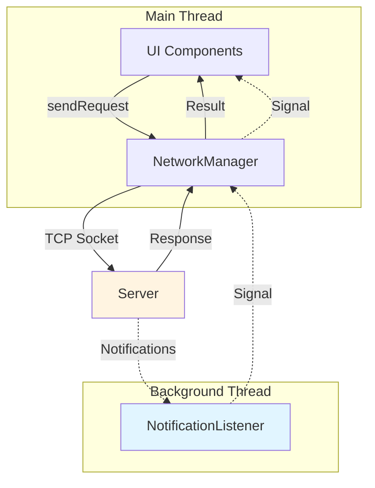
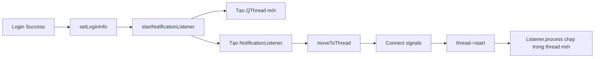

# Cơ chế Network của Client

## Tổng quan

Client sử dụng **TCP Socket thuần** để giao tiếp với server, không sử dụng HTTP hay WebSocket. Đây là kiến trúc client-server truyền thống với giao thức tùy chỉnh.

## Kiến trúc



### Các thành phần chính

1. **NetworkManager**: Quản lý kết nối và giao tiếp đồng bộ
2. **NotificationListener**: Thread nền lắng nghe thông báo bất đồng bộ
3. **QMutex**: Đảm bảo thread-safe khi truy cập socket

## Chi tiết cơ chế

### 1. Kết nối đến Server

**File**: [`networkmanager.cpp`](file://wsl.localhost/Ubuntu/home/khang/meeting-management/client-qt/src/networkmanager.cpp#L19-L46)

```cpp
bool NetworkManager::connectToServer(const QString &ip, int port)
```

**Các bước**:

1. **Tạo socket**: `socket(AF_INET, SOCK_STREAM, 0)`
   - `AF_INET`: IPv4
   - `SOCK_STREAM`: TCP socket
   - Trả về file descriptor (số nguyên đại diện cho socket)

2. **Cấu hình địa chỉ server**:
   ```cpp
   struct sockaddr_in serverAddr;
   serverAddr.sin_family = AF_INET;           // IPv4
   serverAddr.sin_port = htons(port);         // Convert port sang network byte order
   inet_pton(AF_INET, ip, &serverAddr.sin_addr); // Convert IP string sang binary
   ```

3. **Kết nối**: `connect(m_socketFd, ...)`
   - Thiết lập kết nối TCP 3-way handshake
   - Blocking call - đợi cho đến khi kết nối thành công hoặc thất bại

4. **Đánh dấu trạng thái**: `m_connected = true`

### 2. Gửi Request và Nhận Response (Đồng bộ)

**File**: [`networkmanager.cpp`](file://wsl.localhost/Ubuntu/home/khang/meeting-management/client-qt/src/networkmanager.cpp#L63-L85)

```cpp
QString NetworkManager::sendRequest(const QString &command)
```

**Cơ chế hoạt động**:

```mermaid
sequenceDiagram
    participant UI as UI Thread
    participant NM as NetworkManager
    participant Socket as TCP Socket
    participant Server as Server
    
    UI->>NM: sendRequest("LOGIN|username=u;password=p\r\n")
    NM->>NM: Lock mutex (thread-safe)
    NM->>Socket: send() - gửi command
    NM->>Socket: recv() - đợi response
    Socket-->>Server: TCP packet
    Server-->>Socket: Response packet
    Socket->>NM: Nhận data vào buffer
    NM->>NM: Unlock mutex
    NM->>UI: Return response QString
```

**Chi tiết từng bước**:

1. **Lock mutex** (`QMutexLocker`):
   - Đảm bảo chỉ có 1 thread gửi/nhận request tại 1 thời điểm
   - Tránh xung đột với NotificationListener

2. **Gửi dữ liệu**:
   ```cpp
   send(m_socketFd, cmdStr.c_str(), cmdStr.length(), 0)
   ```
   - Gửi toàn bộ command string qua socket
   - Blocking call - đợi cho đến khi OS gửi xong

3. **Nhận response**:
   ```cpp
   char buffer[BUFFER_SIZE]; // 4096 bytes
   int n = recv(m_socketFd, buffer, BUFFER_SIZE - 1, 0);
   ```
   - **Blocking call** - thread sẽ dừng lại và đợi
   - Đọc tối đa BUFFER_SIZE - 1 bytes
   - Thêm null terminator: `buffer[n] = '\0'`

4. **Convert sang QString**: `QString::fromUtf8(buffer)`
   - Hỗ trợ tiếng Việt và các ký tự Unicode

**⚠️ Lưu ý**: Request-Response là **ĐỒNG BỘ** (blocking). UI thread phải đợi response trước khi tiếp tục.

### 3. Lắng nghe Notifications (Bất đồng bộ)

Đây là phần **quan trọng nhất** - cho phép server "push" thông báo đến client.

#### 3.1. Khởi động Notification Listener

**File**: [`networkmanager.cpp`](file://wsl.localhost/Ubuntu/home/khang/meeting-management/client-qt/src/networkmanager.cpp#L137-L155)

```cpp
void NetworkManager::startNotificationListener()
```

**Khi nào được gọi?**: Ngay sau khi login thành công

**Cơ chế**:



**Qt Threading Pattern**:
1. Tạo `QThread` object
2. Tạo worker object (`NotificationListener`)
3. Di chuyển worker vào thread: `moveToThread()`
4. Kết nối signals:
   - `thread->started()` → `listener->process()`: Bắt đầu lắng nghe
   - `listener->finished()` → `thread->quit()`: Dừng thread
   - `listener->notificationReceived()` → `NetworkManager->notificationReceived()`: Forward signal lên UI
   - `listener->connectionLost()` → Xử lý mất kết nối

#### 3.2. Vòng lặp lắng nghe (Notification Loop)

**File**: [`networkmanager.cpp`](file://wsl.localhost/Ubuntu/home/khang/meeting-management/client-qt/src/networkmanager.cpp#L181-L219)

```cpp
void NotificationListener::process()
```

**Đây là vòng lặp chạy liên tục trong background thread**:

```cpp
while (m_running) {
    // 1. Setup select() để kiểm tra socket có dữ liệu không
    fd_set readFds;
    FD_ZERO(&readFds);
    FD_SET(m_socketFd, &readFds);
    
    // 2. Timeout 100ms
    struct timeval tv;
    tv.tv_sec = 0;
    tv.tv_usec = 100000; // 100ms
    
    // 3. Chờ dữ liệu (NON-BLOCKING với timeout)
    int result = select(m_socketFd + 1, &readFds, nullptr, nullptr, &tv);
    
    // 4. Nếu có dữ liệu
    if (result > 0 && FD_ISSET(m_socketFd, &readFds)) {
        // 5. "Nhìn trộm" dữ liệu (MSG_PEEK - không xóa khỏi buffer)
        int n = recv(m_socketFd, buffer, BUFFER_SIZE - 1, MSG_PEEK);
        
        // 6. Kiểm tra xem có phải notification không
        QString data = QString::fromUtf8(buffer);
        if (data.startsWith("NTF|")) {
            // 7. Thực sự đọc và xóa khỏi buffer
            recv(m_socketFd, buffer, n, 0);
            
            // 8. Parse và emit signal
            QString type = NetworkManager::getValue(data, "type");
            emit notificationReceived(type, data);
        }
    }
}
```

**Giải thích chi tiết**:

##### `select()` system call

```cpp
int select(int nfds, fd_set *readfds, fd_set *writefds, fd_set *exceptfds, struct timeval *timeout);
```

**Tại sao dùng select()?**
- **Non-blocking check**: Không muốn `recv()` block mãi mãi
- **Timeout**: Mỗi 100ms check một lần xem socket có dữ liệu không
- **CPU-friendly**: Không busy-wait, OS sẽ sleep thread cho đến khi:
  - Có dữ liệu trên socket, HOẶC
  - Timeout (100ms)

**Cách hoạt động**:
1. `FD_ZERO(&readFds)`: Xóa set
2. `FD_SET(m_socketFd, &readFds)`: Thêm socket vào set cần theo dõi
3. `select()` block tối đa 100ms
4. Trả về:
   - `> 0`: Có dữ liệu sẵn sàng đọc
   - `= 0`: Timeout, không có dữ liệu
   - `< 0`: Lỗi

##### `MSG_PEEK` flag

```cpp
recv(m_socketFd, buffer, BUFFER_SIZE - 1, MSG_PEEK);
```

**Tại sao PEEK trước?**
- **Không xóa dữ liệu** khỏi socket buffer
- Kiểm tra xem message có phải notification (`NTF|`) không
- Nếu không phải (ví dụ: response cho request từ main thread), để nguyên cho main thread đọc

**Workflow**:
1. `MSG_PEEK`: Đọc nhưng không xóa
2. Kiểm tra `startsWith("NTF|")`
3. Nếu đúng: `recv()` không có flag để thực sự xóa khỏi buffer
4. Nếu sai: Bỏ qua, để main thread xử lý

##### Connection Lost Detection

```cpp
if (n == 0) {
    emit connectionLost();
    break;
}
```

**Khi nào `recv()` trả về 0?**
- Server đóng kết nối gracefully
- TCP connection bị đóng

### 4. Format giao thức

Theo [`payload.md`](file://wsl.localhost/Ubuntu/home/khang/meeting-management/docs/payload.md):

#### Request Format
```
COMMAND|param1=value1;param2=value2;...paramN=valueN\r\n
```

**Ví dụ**:
```
LOGIN|username=student1;password=123456\r\n
BOOK_MEETING_INDIV|token=abc123;teacher_id=5;slot_id=10\r\n
```

#### Response Format
```
STATUS_CODE|key1=val1;key2=val2;...keyN=valN\r\n
```

**Ví dụ**:
```
200|user_id=1;role=STUDENT;token=xyz789;msg=Login_OK\r\n
404|msg=Meeting_not_found\r\n
```

#### Notification Format
```
NTF|type=EVENT_TYPE;param1=val1;param2=val2\r\n
```

**Ví dụ**:
```
NTF|type=MEETING_BOOKED;meeting_id=15;slot_id=10\r\n
NTF|type=MEETING_CANCELLED;meeting_id=15;cancelled_by=3\r\n
NTF|type=NEW_JOIN_REQUEST;request_id=7;group_id=2;user_id=8;username=John Doe;note=Please add me\r\n
```

### 5. Parsing Response/Notification

#### 5.1. Lấy Status Code

**File**: [`networkmanager.cpp`](file://wsl.localhost/Ubuntu/home/khang/meeting-management/client-qt/src/networkmanager.cpp#L106-L113)

```cpp
int NetworkManager::getStatusCode(const QString &response)
```

**Logic**:
```cpp
// Input: "200|user_id=1;role=STUDENT\r\n"
QStringList parts = response.split('|');  // ["200", "user_id=1;role=STUDENT\r\n"]
if (!parts.isEmpty()) {
    code = parts[0].toInt();  // 200
}
```

#### 5.2. Lấy giá trị theo key

**File**: [`networkmanager.cpp`](file://wsl.localhost/Ubuntu/home/khang/meeting-management/client-qt/src/networkmanager.cpp#L115-L135)

```cpp
QString NetworkManager::getValue(const QString &response, const QString &key)
```

**Logic**:
```cpp
// Input: "200|user_id=1;role=STUDENT;token=abc\r\n", key="role"

// 1. Tìm vị trí dấu '|' đầu tiên
int pipeIndex = response.indexOf('|');  // = 3

// 2. Lấy phần payload sau '|'
QString payload = response.mid(pipeIndex + 1);  // "user_id=1;role=STUDENT;token=abc\r\n"

// 3. Xóa \r và \n
payload.remove('\r');
payload.remove('\n');  // "user_id=1;role=STUDENT;token=abc"

// 4. Split bằng ';'
QStringList pairs = payload.split(';');  // ["user_id=1", "role=STUDENT", "token=abc"]

// 5. Duyệt từng cặp key=value
for (const QString &pair : pairs) {
    int eqIndex = pair.indexOf('=');  // Vị trí dấu '='
    if (eqIndex > 0) {
        QString k = pair.left(eqIndex);      // "role"
        QString v = pair.mid(eqIndex + 1);   // "STUDENT"
        if (k == key) {
            return v;  // Trả về "STUDENT"
        }
    }
}
```

### 6. Thread Safety

#### Vấn đề
- **Main thread**: Gửi request/nhận response
- **Background thread**: Lắng nghe notifications
- **Cùng sử dụng 1 socket** → Có thể xung đột!

#### Giải pháp: QMutex

```cpp
class NetworkManager {
    QMutex m_socketMutex;  // Shared mutex
}
```

**Main thread** (sendRequest):
```cpp
QMutexLocker locker(&m_socketMutex);  // Lock
send(...);   // Gửi request
recv(...);   // Nhận response
// Auto unlock khi ra khỏi scope
```

**Background thread** (NotificationListener):
```cpp
// KHÔNG lock khi chỉ recv(MSG_PEEK)
// Vì MSG_PEEK không làm thay đổi buffer
```

**Tại sao NotificationListener không lock?**
- Chỉ **đọc** (với MSG_PEEK), không **ghi**
- Main thread đã lock khi send+recv
- Tránh deadlock và giảm contention

### 7. Luồng hoạt động tổng thể

```mermaid
sequenceDiagram
    participant User as User
    participant UI as UI Widget
    participant NM as NetworkManager
    participant Socket as TCP Socket
    participant NL as NotificationListener
    participant Server as Server
    
    Note over User,Server: 1. Kết nối và Login
    
    User->>UI: Nhấn Connect
    UI->>NM: connectToServer(ip, port)
    NM->>Socket: socket() + connect()
    Socket->>Server: TCP Handshake
    Server-->>Socket: Connected
    NM-->>UI: true
    
    User->>UI: Nhập username/password
    UI->>NM: sendRequest("LOGIN|...")
    NM->>Socket: send("LOGIN|...")
    Socket->>Server: Login request
    Server->>Socket: "200|user_id=1;token=xyz..."
    Socket->>NM: recv()
    NM-->>UI: "200|..."
    UI->>NM: setLoginInfo(userId, token, role, name)
    NM->>NM: startNotificationListener()
    NM->>NL: Tạo background thread
    
    Note over NL,Server: 2. Background thread lắng nghe
    
    loop Every 100ms
        NL->>Socket: select() - check có dữ liệu?
        Socket-->>NL: Có/Không
        alt Có notification
            Server->>Socket: "NTF|type=MEETING_BOOKED;..."
            NL->>Socket: recv(MSG_PEEK)
            NL->>NL: Kiểm tra startsWith("NTF|")
            NL->>Socket: recv() - đọc thật
            NL->>NM: emit notificationReceived(type, data)
            NM->>UI: emit notificationReceived(type, data)
            UI->>UI: Hiển thị popup/cập nhật UI
        end
    end
    
    Note over User,Server: 3. User thực hiện hành động
    
    User->>UI: Đặt lịch hẹn
    UI->>NM: sendRequest("BOOK_MEETING_INDIV|...")
    NM->>NM: Lock mutex
    NM->>Socket: send("BOOK_MEETING_INDIV|...")
    Socket->>Server: Request
    Server->>Socket: "201|meeting_id=15;..."
    Socket->>NM: recv()
    NM->>NM: Unlock mutex
    NM-->>UI: "201|..."
    UI->>UI: Hiển thị thành công
    
    Note over Server,UI: 4. Server gửi notification cho teacher
    
    Server->>Socket: "NTF|type=MEETING_BOOKED;meeting_id=15"
    NL->>Socket: select() phát hiện dữ liệu
    NL->>Socket: recv(MSG_PEEK) + recv()
    NL->>UI: notificationReceived signal
    
    Note over User,Server: 5. Logout và Disconnect
    
    User->>UI: Logout
    UI->>NM: clearLoginInfo()
    NM->>NM: stopNotificationListener()
    NM->>NL: stop()
    NL->>NL: m_running = false, thoát loop
    NL->>NL: emit finished()
    NM->>NM: thread->quit() + wait()
    UI->>NM: disconnectFromServer()
    NM->>Socket: close(m_socketFd)
```

## Ưu điểm và Nhược điểm

### ✅ Ưu điểm

1. **Đơn giản**: Không cần HTTP server, WebSocket library
2. **Hiệu suất cao**: TCP thuần, ít overhead
3. **Dual-mode**: Hỗ trợ cả request-response và push notification
4. **Thread-safe**: Sử dụng QMutex đúng cách
5. **Real-time**: Notification đến ngay lập tức (trong vòng 100ms)

### ❌ Nhược điểm

1. **Blocking I/O**: Main thread bị block khi sendRequest
   - **Giải pháp**: Có thể dùng async request với callback
   
2. **Buffer size cố định**: 4096 bytes
   - **Giải pháp**: Cần thêm logic để đọc message dài hơn
   
3. **No reconnection logic**: Nếu mất kết nối, phải kết nối lại thủ công
   - **Giải pháp**: Thêm auto-reconnect trong `connectionLost` handler
   
4. **No message queuing**: Chỉ xử lý 1 notification tại 1 thời điểm
   - **Giải pháp**: Hiện tại OK vì notification ít, nhưng có thể thêm queue nếu cần

5. **No encryption**: Dữ liệu truyền plain text
   - **Giải pháp**: Có thể thêm SSL/TLS wrapper

## Cách sử dụng trong code

### Ví dụ 1: Login

```cpp
// File: loginwidget.cpp
QString command = QString("LOGIN|username=%1;password=%2\r\n")
    .arg(username).arg(password);

QString response = networkManager->sendRequest(command);
int statusCode = NetworkManager::getStatusCode(response);

if (statusCode == 200) {
    int userId = NetworkManager::getValue(response, "user_id").toInt();
    QString token = NetworkManager::getValue(response, "token");
    QString role = NetworkManager::getValue(response, "role");
    QString fullName = NetworkManager::getValue(response, "full_name");
    
    networkManager->setLoginInfo(userId, token, role, fullName);
    // → Tự động start notification listener
}
```

### Ví dụ 2: Đặt lịch

```cpp
// File: studentwidget.cpp
QString command = QString("BOOK_MEETING_INDIV|token=%1;teacher_id=%2;slot_id=%3\r\n")
    .arg(networkManager->getToken())
    .arg(teacherId)
    .arg(slotId);

QString response = networkManager->sendRequest(command);
int statusCode = NetworkManager::getStatusCode(response);

if (statusCode == 201) {
    QString meetingId = NetworkManager::getValue(response, "meeting_id");
    QMessageBox::information(this, "Success", "Meeting booked!");
} else {
    QString msg = NetworkManager::getValue(response, "msg");
    QMessageBox::warning(this, "Error", msg);
}
```

### Ví dụ 3: Xử lý Notification

```cpp
// File: studentwidget.cpp (trong constructor)
connect(networkManager, &NetworkManager::notificationReceived,
        this, &StudentWidget::handleNotification);

// Handler
void StudentWidget::handleNotification(const QString &type, const QString &payload) {
    if (type == "MEETING_BOOKED") {
        QString meetingId = NetworkManager::getValue(payload, "meeting_id");
        // Refresh UI
        refreshMeetingList();
        
    } else if (type == "MEETING_CANCELLED") {
        QString meetingId = NetworkManager::getValue(payload, "meeting_id");
        QMessageBox::information(this, "Notification", 
            "Meeting " + meetingId + " has been cancelled");
        refreshMeetingList();
        
    } else if (type == "GROUP_APPROVED") {
        QString groupId = NetworkManager::getValue(payload, "group_id");
        QMessageBox::information(this, "Notification", 
            "Your request to join group has been approved!");
    }
}
```

## Kết luận

Cơ chế network của client được thiết kế với:

- **TCP socket thuần** cho kết nối bền vững
- **Đồng bộ** cho request-response (UI đợi kết quả)
- **Bất đồng bộ** cho notifications (background thread)
- **Thread-safe** với QMutex
- **Protocol đơn giản** dễ parse và debug

Kiến trúc này phù hợp cho ứng dụng desktop Qt với yêu cầu real-time notification và quản lý meeting.
